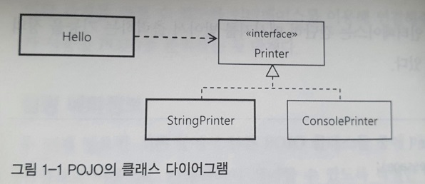
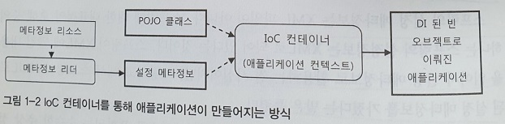
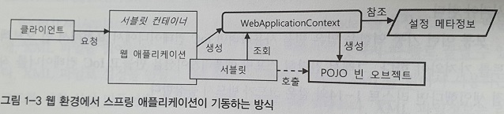

# 1.1 IoC 컨테이너 : 빈 팩토리와 애플리케이션 컨텍스트

1.1.1 IoC 컨테이너

- 스프링 애플리케이션에서는 오브젝트의 생성, 관계설정, 사용, 제거 등의 작업을 애플리케이션 코드 대신 **독립된 컨테이너**가 담당함
- 컨테이너가 코드 대신 오브젝트에 대한 **제어권**을 갖고 있다고 해서 **IoC 컨테이너**라 불림
- 오브젝트의 생성과 런타임 관계를 설정하는 DI 관점으로 볼 때 컨테이너를 **빈 팩토리**라 함
- 스프링 컨테이너는 단순한 DI 작업보다 더 많은 일을 함
- 빈 팩토리에 여러 가지 컨테이너 기능을 추가한 것을 **애플리케이션 컨텍스트**라 부름
- IoC 컨테이너는 일반적으로 애플리케이션 컨텍스트를 말함
- 스프링의 빈 팩토리와 애플리케이션는 각각 기능을 대표하는 `BeanFactory`와 `ApplicationContext`라는 두 개의 인터페이스로 정의되어 있음
- `ApplicationContext`는 `ListableBeanFactory`와 `HierachicalBeanFactory`를 상속받음
    
    ```java
    package org.springframework.context; 
    public interface ApplicationContext extends EnvironmentCapable, 
                                                ListableBeanFactory, 
                                                HierarchicalBeanFactory, 
                                                MessageSource, 
                                                ApplicationEventPublisher, 
                                                ResourcePatternResolver { 
        // ... 
    }
    
    ```
    
- `ListableBeanFactory`와 `HierachicalBeanFactory`는 `BeanFactory`의 하위 클래스임
- 즉, `ApplicationContext`는 `BeanFactory`의 서브인터페이스임
- 스프링 애플리케이션은 최소 하나 이상의 IoC 컨테이너, 즉 애플리케이션 컨텍스트를 갖고 있음
- 한 개 이상의 애플리켕션 컨텍스트 오브젝트를 갖는 경우가 많기 때문임

1.1.2 IoC 컨테이너를 이용해 애플리케이션 만들기

- 가장 간단하게 IoC 컨테이너를 만드는 방법은 `ApplicationContext` 구현 인스턴스를 만드는 것임
    
    ```java
    StaticApplicationContext ac = new StaticApplicationContext;
    ```
    
- `StaticApplicationContext`는 아무것도 없는 빈 컨테이너임
- 만들어진 컨테이너가 본격적인 IoC 컨테이너로 동작하려면 **두 가지**가 필요함
    1. POJO 클래스
    2. 설정 메타정보

1.1.3 POJO 클래스

- 애플리케이션 핵심 코드를 담고 있으며, DI를 받기 위한 클래스임
- POJO는 특정 기술과 스펙에서 **독립적**이고 다른 POJO와 **느슨한 결합**을 갖도록 만들어야 함
- 서로 관계를 맺을 때 최소한의 인터페이스 정보만 공유하면 됨
- `Hello` 클래스는 `Printer` 인터페이스를 구현한 오브젝트라면 어떤 것이든 사용할 수 있음
    
    
    
- `Hello` 클래스는 POJO 클래스로 `Printer`의 구현 클래스가 변경 되더라도 영향을 받지 않음

1.1.4 설정 메타정보

- POJO 클래스들 중에 애플리케이션에서 사용할 것을 **선정**하고, 이를 IoC 컨테이너가 **제어**할 수 있도록 적절한 **메타정보**를 만들어 **제공**해야 함
- IoC 컨테이너의 가장 기초적인 역할은 오브젝트를 **생성**하고 **관리**하는 것임
- 스프링 컨테이너가 관리하는 이런 오브젝트를 **빈(Bean)**이라 부름
- 설정 메타정보는 바로 이 빈을 어떻게 만들고 동작하게 할 것인가에 대한 정보임
- 애플리케이션 컨텍스트는 바로 `BeanDefinition`으로 만들어진 **메타정보**를 담은 오브젝트를 사용해 IoC와 DI 작업을 수행함
- 스프링의 메타정보는 특정한 파일 포맷이나 형식에 제하되거나 종속되지 않음
- `BeanDefinition`으로 정의되는 스프링의 설정 메타정보의 내용을 표현한 것이 있다면 무엇이든 사용할 수 있음
- 원본은 포맷, 구조, 자료 특정에 맞게 읽어와 `BeanDefinition`으로 변환해주는 것이 바로 `BeanDefinitionReader`임
- `BeanDefinition`와 `BeanDefinitionReader` 둘 다 인터페이스임
- `BeanDefinitionReader`를 구현한 리더를 만들기만 하면 스프링의 설정 메타정보는 어떤 형식으로든 작성할 수 있음
- IoC 컨테이너가 사용하는 빈 메타정보는 여러 가지가 있음
    1. 빈 아이디, 이름, 별칭 : 빈 오브젝트를 구분할 수 있는 식별자
    2. 클래스 또는 클래스 이름 : 빈으로 만들 POJO 클래스 또는 서비스 클래스 정보
    3. 스코프 : 싱글톤, 프로토 타입과 같은 빈의 생성 방식과 존재 범위
    4. 프로퍼티 값 또는 참조 : DI에 사용할 프로퍼티 이름, 값, 참조하는 빈의 이름
    5. 생성자 파라미터 값 또는 참조 : DI에 사용할 생성자 파라미터 이름, 값, 참조하는 빈의 이름
    6. 지연로딩 여부, 우선 빈 여부, 자동와이어링 여부, 부모 빈 정보, 빈팩토리 이름 등
- 스프링 IoC 컨테이너는 각 빈에 대한 설정 메타정보를 읽고, 이를 참조해서 빈을 생성하고, DI 작업을 수행함
- 이 작업을 통해 만들어지고, DI 되는 오브젝트들이 모여서 하나의 애플리케이션을 **구성**하고 **동작**함
    
    
    
- 결국, **스프링 애플리케이션**이란 **POJO 클래스**와 **설정 메타정보**를 이용해 IoC 컨테이너가 만들어주는 오브젝트의 조합이라 할 수 있음
- 빈 메타정보의 항목들은 대부분 **디폴트 값**이 있음
- 반드시 제공해줘야 하는 정보는 빈 이름과 POJO 클래스 뿐임
    
    ```java
    StaticApplicationContext ac = new StaticApplicationContext;
    //hello1라는 빈 이름으로 싱글톤 빈으로 컨테이너 등록
    ac.registerSingleton("hello1", Hello.class);
    Hello hello1 = ac.getBean("hello1", Hello.class);
    assertThat(hello1, is(notNullValue()));
    ```
    
- `StaticApplicationContext`는 **코드**에 의해 설정 메타정보를 등록하는 애플리케이션 컨텍스트임
- 빈은 클래스가 아닌 **오브젝트 단위**임
- 같은 클래스의 빈을 여러개 등록하는 이유는 각 빈마다 다른 설정을 하기 위함임
- `registerSingleton`대신, 직접 `BeanDefinition` 타입의 설정 메타정보를 만들 수도 있음
    
    ```java
    //<bean class="spring.com...Hello"/>와 같음
    BeanDefinition helloDef = new RootBeanDefinition(Hello.class);
    //<property name="name" value="Spring">와 같음
    helloDef.getPropertyValues().addPropertyValue("name", "Spring");
    ac.registerBeanDefinition("hello2", helloDef);
    Hello hello2 = ac.getBean("hello2", Hello.class);
    // 서로 다른 오브젝트인지 비교
    assertThat(hello1, is(not(hello2)));
    ```
    
- 빈 오브젝트를 생성하는 것이 IoC 컨테이너의 **핵심기능**임
- 일단 빈 오브젝트가 생성되고 관계가 만들어지면 그 뒤로 거의 관여하지 않음

<aside>
💡 기본적으로 싱글톤 빈은 애플리케이션 컨텍스트 “초기화” 작업 중에 모두 만들어짐

</aside>

1.1.5 IoC 컨테이너의 종류와 사용 방법

- `ApplicationContext`를 바르게 구현했다면 어떤 크래스든 스프링의 IoC 컨테이너로 사용할 수 있음
- 스프링에서 다양한 `ApplicationContext` 구현 클래스를 제공하기 때문에, 개발자가 직접 `ApplicationContext`를 구현하는 일은 없을 것임
- 스프링이 제공하는 `ApplicationContext`는 십여가지가 있음
- 대표적인 네 가지를 설명 할 것임
    - `StaticAplicationContext`
    - `GenericApplicationContext`
    - `GenericXmlApplicationContext`
    - `WebApplicationContext`

1.1.6 StaticAplicationContext

- `StaticAplicationContext`는 **코드**를 통해 빈 메타정보를 등록하기 위해 사용됨
- 학습 테스트를 만들 때를 제외하면 실제로 사용되지 않음
- 테스트 목적으로 코드를 통해 빈을 등록하고 컨테이너가 어떻게 동작하는지 확인 할 때만 사용됨

1.1.7 GenericApplicationContext

- 가장 일반적인 애플리케이션 컨텍스트의 구현 클래스임
- XML 파일과 같은 **외부의 리소스**에 있는 빈 설정 메타정보를 **리더**로 읽어서 메타 정보로 전환함
- XML로 작선된 빈 설정정보를 읽는 리더 클래스는 `XmlBeanDefinitionReader`임
    
    ```java
    GenericApplicationContext ac = new GenericApplicationContext();
    XmlBeanDefinitionReader reader = new XmlBeanDefinitionReader(ac);
    reader.loadBeanDefinition("spring/com/...test-context.xml");//xml 경로
    ac.refesh(); //모든 메타정보가 등록 되었으니, 컨테이너를 초기화하라는 명령
    ```
    
    <aside>
    💡 컨테이너 초기화시 모든 싱글톤 빈이 생성됨
    
    </aside>
    
- `XmlBeanDefinitionReader`는 크래스 패스 리소스로 인식함
- 때문에 classpath:, file:, http: 같은 접두어를 사용할 수 있음
- 프로퍼티 파일에서 빈 설정 메타정보를 읽는 것은 `PropertiesBeandefinitionReader`임
- 스프링에서는 대표적으로 **세 가지** 방식으로 빈 설정 메타정보를 작성할 수 있음
    1. XML
    2. 애노테이션
    3. 자바 클래스 
- 물론, 세 가지 방식으로 제한되지 않고 얼마든지 유연하게 확장할 수 있음
    
    <aside>
    💡 스프링 자체가 객체지향적인 설계의 핵심 가치를 컨테이너에서도 충실하게 적용하고 있기 때문임
    
    </aside>
    
- `GenericApplicationContext`는 여러 리소스로 부터 설정 메타정보를 읽게 할 수 있음
- 모든 설정 메타정보를 가져온 다음에 refresh()를 통해 **초기화**만 해만 됨
- 새로운 프레임워크를 만들거나, 스프링을 사용하는 독립 애플리케이션을 만들지 않는 한 `GenericApplicationContext`을 직접 이용할 일은 없을 것임
- 그런데, `GenericApplicationContext`는 코드에서 직접 만들고 초기화하지 않을 뿐이지 실제로 자주 사용됨
- JUnit 테스트에서 애플리케이션을 자동으로 만들어주는데, 이때 생성되는 애플리케이션 컨텍스트가 `GenericApplicationContext`임
    
    ```java
    @RunWith(SpringJUnit4ClassRunner.class)
    //애플리케이션 컨텍스트 생성과 동시에 XML파일을 읽어오고 초기화까지 수행됨
    @ContextConfiguration(locations = "/vol1/junit.xml")
    public class JUnitTest {...}
    ```
    

1.1.8 GenericXmlApplicationContext

- 번거롭게 `XmlBeanDefinitionReader`를 직접 만들지 않고, `GenericApplicationContext`와 결합된 것이 `GenericXmlApplicationContext`임
- `XmlBeanDefinitionReader`를 내장하기 때문에, XML파일을 읽고 초기화하는 것 까지 한 줄로 가능함
    
    ```java
    //애플리케이션 컨텍스트 생성과 동시에 XML 파일을 읽고 초기화까지 수행
    GenericXmlApplicationContext ac = new GenericXmlApplicationContext("/vol1/junit.xml");
    Hello hello = ac.getBean("hello", Hello.class);
    ```
    

1.1.9 WebApplicationContext

- 가장 많이 사용되는 애플리케이션 컨텍스트임
- 정확히는 `WebApplicationContext` 역시 `ApplicationContext`를 확장한 **인터페이스**이므로, `WebApplicationContext`를 구현한 클래스를 사용해야 함
- `WebApplicationContext`는 **웹 환경**에서 사용할 때 필요한 기능이 추가된 애플리케이션 컨텍스트임
- 가장 많이 사용되는 것은, XML 설정파일을 사용하도록 만들어진 `XMLWebApplicationContext`임
- 애노테이션을 이용한다면 `AnnotationConfigWebApplicationContext`를 쓰지만, 디폴트는 `XMLWebApplicationContext`임
- `WebApplicationContext` 사용 방법을 이해하려면 스프링의 IoC 컨테이너를 적용했을 때 애플리케이션을 기동시키는 방법을 알아야 함
- 스프링의 IoC 컨테이너는 빈 설정 메타정보를 이용해 빈 오브젝트를 만들고 DI 작업을 수행함
- 하지만, 그것만으로 애플리케이션이 동작하지 않음
- main()과 같이 어디선가 특정 빈 오브젝트의 메소드를 호출해야 애플리케이션을 동작시킬 수 있음
- 보통 이런 기동 역할을 빈을 사용하려면 IoC 컨테이너에서 빈 오브젝트를 가져와야 함
- 그리고 알맞는 메소드를 실행해야 함
    
    ```java
    ApplicationContext ac = ...
    //getBean()을 통해 빈 오브젝트를 가져옴
    Hello hello = ac.getBean("hello", Hello.class);
    //메소드 실행으로 애플리케이션을 기동 시킴
    hello.print()
    ```
    
- print()를 실행 했다면, 빈 오브젝트인 hello에 의해 애플리케이션이 동작함
- 웹 애플리케이션은 동작 방식이 근본적으로 다름
- 독립 자바 프로그램은 자바 VM에게 main() 클래스를 가진 클래스를 시작하도록 요청할 수 있음
- 하지만, 웹에서는 main()을 호출할 방법이 없음
- 또한, 웹의 사용자는 한 명 이상이고 동시에 사용함
- 때문에 웹 환경에서는 main() 대신 **서블릿 컨테이너**가 브라우저로 부터 오는 HTTP 요청을 받아서 해당 요청에 매핑되어 있는 **서블릿**을 실행하는 방식으로 동작함
- 서블릿이 일종의 main()와 같은 역할을 하는 셈임
- 웹 애플리케이션에서 스프링 애플리케이션을 기동시키는 방법은 **서블릿**을 만들어두고, 미리 **애플리케이션 컨텍스트**를 생성한 다음, 요청이 서블릿으로 올 때 마다 getBean()으로 필요한 빈을 가져와 **정해진 메소드를 실행**하면 됨
    
    
    
- 서블릿 컨테이너는 서블릿을 동작시키는 일을 맡음
- **서블릿**은 웹 애플리케이션이 시작될 때 미리 만들어둔 **웹 애플리케이션 컨텍스트에게** 빈 오브젝트로 구성된 애플리케이션의 기동 역할을 해줄 **빈을 요청해서 받음**
- 그리고 미리 지정된 메소드를 호출함으로써 스프링 컨테이너가 DI 방식으로 구성해둔 애플리케이션의 기능이 시작되는 것임
- 다행히 스프링은 웹 환경에서 애플리케이션 컨텍스트를 생성하고, 설정 메타정보를 초기화하고, 클라이언트로부터 들어오는 요청마다 적절한 빈을 찾아서 이를 실행하는 `DispatcherServlet`이름의 **서블릿**을 제공함
- `DispatcherServlet`을 web.xml에 등록하는 것만으로 웹 환경에서 스프링 컨테이너가 만들어지고 애플리케이션을 실행하는 데 필요한 대부분의 준비는 끝남
- 일단 웹 애플리케이선에서 만들어지는 스프링 IoC 컨테이너는 `WebApplicationContext` 인터페이스를 구현한 것임을 기억해야 함
- `WebApplicationContext`의 특징은 자신이 만들어지고 동작하는 환경인 웹 모둘에 대한 정보에 접근할 수 있다는 점임
- 이를 이용해 웹 환경으로부터 필요한 정보를 가져오거나, 웹 환경에 스프링 컨테이너 자신을 노출할 수 잇음
- 컨테이너가 웹 환경에 노출되면같은 웹 모듈에 들어있는 스프링 빈이 아닌 일반 오브젝트와 연동될 수 있음