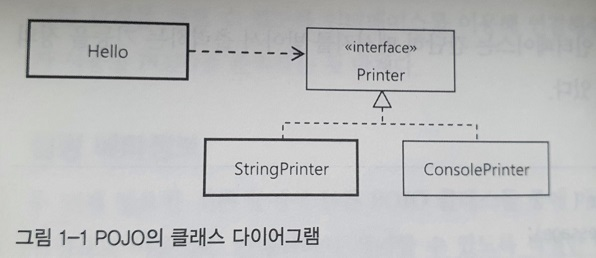
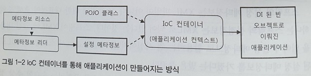
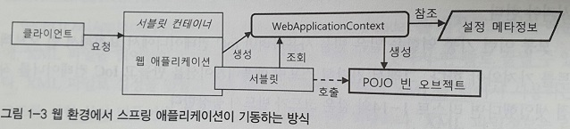
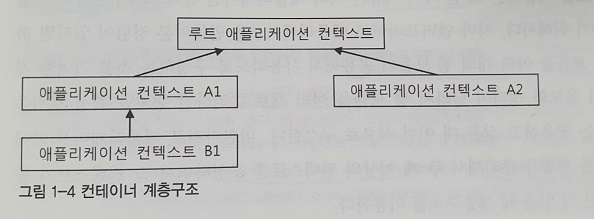
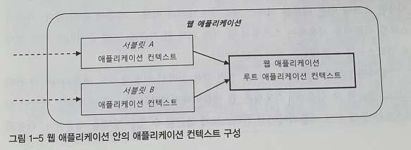
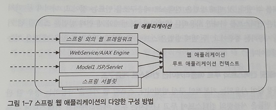

# 1.1 IoC 컨테이너 : 빈 팩토리와 애플리케이션 컨텍스트

1.1.1 IoC 컨테이너

- 스프링 애플리케이션에서는 오브젝트의 생성, 관계설정, 사용, 제거 등의 작업을 애플리케이션 코드 대신 **독립된 컨테이너**가 담당함
- 컨테이너가 코드 대신 오브젝트에 대한 **제어권**을 갖고 있다고 해서 **IoC 컨테이너**라 불림
- 오브젝트의 생성과 런타임 관계를 설정하는 DI 관점으로 볼 때 컨테이너를 **빈 팩토리**라 함
- 스프링 컨테이너는 단순한 DI 작업보다 더 많은 일을 함
- 빈 팩토리에 여러 가지 컨테이너 기능을 추가한 것을 **애플리케이션 컨텍스트**라 부름
- IoC 컨테이너는 일반적으로 애플리케이션 컨텍스트를 말함
- 스프링의 빈 팩토리와 애플리케이션는 각각 기능을 대표하는 `BeanFactory`와 `ApplicationContext`라는 두 개의 인터페이스로 정의되어 있음
- `ApplicationContext`는 `ListableBeanFactory`와 `HierachicalBeanFactory`를 상속받음
    
    ```java
    package org.springframework.context; 
    public interface ApplicationContext extends EnvironmentCapable, 
                                                ListableBeanFactory, 
                                                HierarchicalBeanFactory, 
                                                MessageSource, 
                                                ApplicationEventPublisher, 
                                                ResourcePatternResolver { 
        // ... 
    }
    
    ```
    
- `ListableBeanFactory`와 `HierachicalBeanFactory`는 `BeanFactory`의 하위 클래스임
- 즉, `ApplicationContext`는 `BeanFactory`의 서브인터페이스임
- 스프링 애플리케이션은 최소 하나 이상의 IoC 컨테이너, 즉 애플리케이션 컨텍스트를 갖고 있음
- 한 개 이상의 애플리켕션 컨텍스트 오브젝트를 갖는 경우가 많기 때문임

1.1.2 IoC 컨테이너를 이용해 애플리케이션 만들기

- 가장 간단하게 IoC 컨테이너를 만드는 방법은 `ApplicationContext` 구현 인스턴스를 만드는 것임
    
    ```java
    StaticApplicationContext ac = new StaticApplicationContext;
    ```
    
- `StaticApplicationContext`는 아무것도 없는 빈 컨테이너임
- 만들어진 컨테이너가 본격적인 IoC 컨테이너로 동작하려면 **두 가지**가 필요함
    1. POJO 클래스
    2. 설정 메타정보

1.1.3 POJO 클래스

- 애플리케이션 핵심 코드를 담고 있으며, DI를 받기 위한 클래스임
- POJO는 특정 기술과 스펙에서 **독립적**이고 다른 POJO와 **느슨한 결합**을 갖도록 만들어야 함
- 서로 관계를 맺을 때 최소한의 인터페이스 정보만 공유하면 됨
- `Hello` 클래스는 `Printer` 인터페이스를 구현한 오브젝트라면 어떤 것이든 사용할 수 있음
    
    
    
- `Hello` 클래스는 POJO 클래스로 `Printer`의 구현 클래스가 변경 되더라도 영향을 받지 않음

1.1.4 설정 메타정보

- POJO 클래스들 중에 애플리케이션에서 사용할 것을 **선정**하고, 이를 IoC 컨테이너가 **제어**할 수 있도록 적절한 **메타정보**를 만들어 **제공**해야 함
- IoC 컨테이너의 가장 기초적인 역할은 오브젝트를 **생성**하고 **관리**하는 것임
- 스프링 컨테이너가 관리하는 이런 오브젝트를 **빈(Bean)**이라 부름
- 설정 메타정보는 바로 이 빈을 어떻게 만들고 동작하게 할 것인가에 대한 정보임
- 애플리케이션 컨텍스트는 바로 `BeanDefinition`으로 만들어진 **메타정보**를 담은 오브젝트를 사용해 IoC와 DI 작업을 수행함
- 스프링의 메타정보는 특정한 파일 포맷이나 형식에 제하되거나 종속되지 않음
- `BeanDefinition`으로 정의되는 스프링의 설정 메타정보의 내용을 표현한 것이 있다면 무엇이든 사용할 수 있음
- 원본은 포맷, 구조, 자료 특정에 맞게 읽어와 `BeanDefinition`으로 변환해주는 것이 바로 `BeanDefinitionReader`임
- `BeanDefinition`와 `BeanDefinitionReader` 둘 다 인터페이스임
- `BeanDefinitionReader`를 구현한 리더를 만들기만 하면 스프링의 설정 메타정보는 어떤 형식으로든 작성할 수 있음
- IoC 컨테이너가 사용하는 빈 메타정보는 여러 가지가 있음
    1. 빈 아이디, 이름, 별칭 : 빈 오브젝트를 구분할 수 있는 식별자
    2. 클래스 또는 클래스 이름 : 빈으로 만들 POJO 클래스 또는 서비스 클래스 정보
    3. 스코프 : 싱글톤, 프로토 타입과 같은 빈의 생성 방식과 존재 범위
    4. 프로퍼티 값 또는 참조 : DI에 사용할 프로퍼티 이름, 값, 참조하는 빈의 이름
    5. 생성자 파라미터 값 또는 참조 : DI에 사용할 생성자 파라미터 이름, 값, 참조하는 빈의 이름
    6. 지연로딩 여부, 우선 빈 여부, 자동와이어링 여부, 부모 빈 정보, 빈팩토리 이름 등
- 스프링 IoC 컨테이너는 각 빈에 대한 설정 메타정보를 읽고, 이를 참조해서 빈을 생성하고, DI 작업을 수행함
- 이 작업을 통해 만들어지고, DI 되는 오브젝트들이 모여서 하나의 애플리케이션을 **구성**하고 **동작**함
    
    
    
- 결국, **스프링 애플리케이션**이란 **POJO 클래스**와 **설정 메타정보**를 이용해 IoC 컨테이너가 만들어주는 오브젝트의 조합이라 할 수 있음
- 빈 메타정보의 항목들은 대부분 **디폴트 값**이 있음
- 반드시 제공해줘야 하는 정보는 빈 이름과 POJO 클래스 뿐임
    
    ```java
    StaticApplicationContext ac = new StaticApplicationContext;
    //hello1라는 빈 이름으로 싱글톤 빈으로 컨테이너 등록
    ac.registerSingleton("hello1", Hello.class);
    Hello hello1 = ac.getBean("hello1", Hello.class);
    assertThat(hello1, is(notNullValue()));
    ```
    
- `StaticApplicationContext`는 **코드**에 의해 설정 메타정보를 등록하는 애플리케이션 컨텍스트임
- 빈은 클래스가 아닌 **오브젝트 단위**임
- 같은 클래스의 빈을 여러개 등록하는 이유는 각 빈마다 다른 설정을 하기 위함임
- `registerSingleton`대신, 직접 `BeanDefinition` 타입의 설정 메타정보를 만들 수도 있음
    
    ```java
    //<bean class="spring.com...Hello"/>와 같음
    BeanDefinition helloDef = new RootBeanDefinition(Hello.class);
    //<property name="name" value="Spring">와 같음
    helloDef.getPropertyValues().addPropertyValue("name", "Spring");
    ac.registerBeanDefinition("hello2", helloDef);
    Hello hello2 = ac.getBean("hello2", Hello.class);
    // 서로 다른 오브젝트인지 비교
    assertThat(hello1, is(not(hello2)));
    ```
    
- 빈 오브젝트를 생성하는 것이 IoC 컨테이너의 **핵심기능**임
- 일단 빈 오브젝트가 생성되고 관계가 만들어지면 그 뒤로 거의 관여하지 않음

<aside>
💡 기본적으로 싱글톤 빈은 애플리케이션 컨텍스트 “초기화” 작업 중에 모두 만들어짐

</aside>

1.1.5 IoC 컨테이너의 종류와 사용 방법

- `ApplicationContext`를 바르게 구현했다면 어떤 크래스든 스프링의 IoC 컨테이너로 사용할 수 있음
- 스프링에서 다양한 `ApplicationContext` 구현 클래스를 제공하기 때문에, 개발자가 직접 `ApplicationContext`를 구현하는 일은 없을 것임
- 스프링이 제공하는 `ApplicationContext`는 십여가지가 있음
- 대표적인 네 가지를 설명 할 것임
    - `StaticAplicationContext`
    - `GenericApplicationContext`
    - `GenericXmlApplicationContext`
    - `WebApplicationContext`

1.1.6 StaticAplicationContext

- `StaticAplicationContext`는 **코드**를 통해 빈 메타정보를 등록하기 위해 사용됨
- 학습 테스트를 만들 때를 제외하면 실제로 사용되지 않음
- 테스트 목적으로 코드를 통해 빈을 등록하고 컨테이너가 어떻게 동작하는지 확인 할 때만 사용됨

1.1.7 GenericApplicationContext

- 가장 일반적인 애플리케이션 컨텍스트의 구현 클래스임
- XML 파일과 같은 **외부의 리소스**에 있는 빈 설정 메타정보를 **리더**로 읽어서 메타 정보로 전환함
- XML로 작선된 빈 설정정보를 읽는 리더 클래스는 `XmlBeanDefinitionReader`임
    
    ```java
    GenericApplicationContext ac = new GenericApplicationContext();
    XmlBeanDefinitionReader reader = new XmlBeanDefinitionReader(ac);
    reader.loadBeanDefinition("spring/com/...test-context.xml");//xml 경로
    ac.refesh(); //모든 메타정보가 등록 되었으니, 컨테이너를 초기화하라는 명령
    ```
    
    <aside>
    💡 컨테이너 초기화시 모든 싱글톤 빈이 생성됨
    
    </aside>
    
- `XmlBeanDefinitionReader`는 크래스 패스 리소스로 인식함
- 때문에 classpath:, file:, http: 같은 접두어를 사용할 수 있음
- 프로퍼티 파일에서 빈 설정 메타정보를 읽는 것은 `PropertiesBeandefinitionReader`임
- 스프링에서는 대표적으로 **세 가지** 방식으로 빈 설정 메타정보를 작성할 수 있음
    1. XML
    2. 애노테이션
    3. 자바 클래스 
- 물론, 세 가지 방식으로 제한되지 않고 얼마든지 유연하게 확장할 수 있음
    
    <aside>
    💡 스프링 자체가 객체지향적인 설계의 핵심 가치를 컨테이너에서도 충실하게 적용하고 있기 때문임
    
    </aside>
    
- `GenericApplicationContext`는 여러 리소스로 부터 설정 메타정보를 읽게 할 수 있음
- 모든 설정 메타정보를 가져온 다음에 refresh()를 통해 **초기화**만 해만 됨
- 새로운 프레임워크를 만들거나, 스프링을 사용하는 독립 애플리케이션을 만들지 않는 한 `GenericApplicationContext`을 직접 이용할 일은 없을 것임
- 그런데, `GenericApplicationContext`는 코드에서 직접 만들고 초기화하지 않을 뿐이지 실제로 자주 사용됨
- JUnit 테스트에서 애플리케이션을 자동으로 만들어주는데, 이때 생성되는 애플리케이션 컨텍스트가 `GenericApplicationContext`임
    
    ```java
    @RunWith(SpringJUnit4ClassRunner.class)
    //애플리케이션 컨텍스트 생성과 동시에 XML파일을 읽어오고 초기화까지 수행됨
    @ContextConfiguration(locations = "/vol1/junit.xml")
    public class JUnitTest {...}
    ```
    

1.1.8 GenericXmlApplicationContext

- 번거롭게 `XmlBeanDefinitionReader`를 직접 만들지 않고, `GenericApplicationContext`와 결합된 것이 `GenericXmlApplicationContext`임
- `XmlBeanDefinitionReader`를 내장하기 때문에, XML파일을 읽고 초기화하는 것 까지 한 줄로 가능함
    
    ```java
    //애플리케이션 컨텍스트 생성과 동시에 XML 파일을 읽고 초기화까지 수행
    GenericXmlApplicationContext ac = new GenericXmlApplicationContext("/vol1/junit.xml");
    Hello hello = ac.getBean("hello", Hello.class);
    ```
    

1.1.9 WebApplicationContext

- 가장 많이 사용되는 애플리케이션 컨텍스트임
- 정확히는 `WebApplicationContext` 역시 `ApplicationContext`를 확장한 **인터페이스**이므로, `WebApplicationContext`를 구현한 클래스를 사용해야 함
- `WebApplicationContext`는 **웹 환경**에서 사용할 때 필요한 기능이 추가된 애플리케이션 컨텍스트임
- 가장 많이 사용되는 것은, XML 설정파일을 사용하도록 만들어진 `XMLWebApplicationContext`임
- 애노테이션을 이용한다면 `AnnotationConfigWebApplicationContext`를 쓰지만, 디폴트는 `XMLWebApplicationContext`임
- `WebApplicationContext` 사용 방법을 이해하려면 스프링의 IoC 컨테이너를 적용했을 때 애플리케이션을 기동시키는 방법을 알아야 함
- 스프링의 IoC 컨테이너는 빈 설정 메타정보를 이용해 빈 오브젝트를 만들고 DI 작업을 수행함
- 하지만, 그것만으로 애플리케이션이 동작하지 않음
- main()과 같이 어디선가 특정 빈 오브젝트의 메소드를 호출해야 애플리케이션을 동작시킬 수 있음
- 보통 이런 기동 역할을 빈을 사용하려면 IoC 컨테이너에서 빈 오브젝트를 가져와야 함
- 그리고 알맞는 메소드를 실행해야 함
    
    ```java
    ApplicationContext ac = ...
    //getBean()을 통해 빈 오브젝트를 가져옴
    Hello hello = ac.getBean("hello", Hello.class);
    //메소드 실행으로 애플리케이션을 기동 시킴
    hello.print()
    ```
    
- print()를 실행 했다면, 빈 오브젝트인 hello에 의해 애플리케이션이 동작함
- 웹 애플리케이션은 동작 방식이 근본적으로 다름
- 독립 자바 프로그램은 자바 VM에게 main() 클래스를 가진 클래스를 시작하도록 요청할 수 있음
- 하지만, 웹에서는 main()을 호출할 방법이 없음
- 또한, 웹의 사용자는 한 명 이상이고 동시에 사용함
- 때문에 웹 환경에서는 main() 대신 **서블릿 컨테이너**가 브라우저로 부터 오는 HTTP 요청을 받아서 해당 요청에 매핑되어 있는 **서블릿**을 실행하는 방식으로 동작함
- 서블릿이 일종의 main()와 같은 역할을 하는 셈임
- 웹 애플리케이션에서 스프링 애플리케이션을 기동시키는 방법은 **서블릿**을 만들어두고, 미리 **애플리케이션 컨텍스트**를 생성한 다음, 요청이 서블릿으로 올 때 마다 getBean()으로 필요한 빈을 가져와 **정해진 메소드를 실행**하면 됨
    
    
    
- 서블릿 컨테이너는 서블릿을 동작시키는 일을 맡음
- **서블릿**은 웹 애플리케이션이 시작될 때 미리 만들어둔 **웹 애플리케이션 컨텍스트에게** 빈 오브젝트로 구성된 애플리케이션의 기동 역할을 해줄 **빈을 요청해서 받음**
- 그리고 미리 지정된 메소드를 호출함으로써 스프링 컨테이너가 DI 방식으로 구성해둔 애플리케이션의 기능이 시작되는 것임
- 다행히 스프링은 웹 환경에서 애플리케이션 컨텍스트를 생성하고, 설정 메타정보를 초기화하고, 클라이언트로부터 들어오는 요청마다 적절한 빈을 찾아서 이를 실행하는 `DispatcherServlet`이름의 **서블릿**을 제공함
- `DispatcherServlet`을 web.xml에 등록하는 것만으로 웹 환경에서 스프링 컨테이너가 만들어지고 애플리케이션을 실행하는 데 필요한 대부분의 준비는 끝남
- 일단 웹 애플리케이선에서 만들어지는 스프링 IoC 컨테이너는 `WebApplicationContext` 인터페이스를 구현한 것임을 기억해야 함
- `WebApplicationContext`의 특징은 자신이 만들어지고 동작하는 환경인 웹 모둘에 대한 정보에 접근할 수 있다는 점임
- 이를 이용해 웹 환경으로부터 필요한 정보를 가져오거나, 웹 환경에 스프링 컨테이너 자신을 노출할 수 잇음
- 컨테이너가 웹 환경에 노출되면같은 웹 모듈에 들어있는 스프링 빈이 아닌 일반 오브젝트와 연동될 수 있음

1.1.10 IoC 컨테이너 계층구조

- IoC 컨테이너는 애플리케이션마다 하나씩이면 충분함
- 하나의 애플리케이션 컨텍스트가 여러 개의 설정파일을 사용하면 그만임
    
    <aside>
    💡 IoC 컨테이너에 기능을 추가한 것이 애플리케이션 컨텍스트임
    
    </aside>
    
- 하지만, 트리 모양의 **계층구조**를 만들 때 한 개 이상의 IoC 컨테이너가 필요함

1.1.11 부모 컨텍스트를 이용한 계층구조 효과

- 모든 애플리케이션 컨텍스트는 **부모 애플리케이션 컨텍스트**를 가질 수 있음
- 계층구조 안의 모든 컨텍스트는 각자 독립적인 설정정보를 이용해 빈 오브젝트를 만들고 관리함
    
    
    
- 먼저 **자신**이 관리하는 빈 중에서 필요한 빈을 찾아보고, 없으면 **부모 컨텍스트**에게 빈을 찾아달라고 요청함
- 계층구조를 따라 최상위에 존재하는 **루트 컨텍스트**까지 요청이 전달됨
- **자식 컨텍스트**나 **형제 컨텍스트**에는 요청이 전달되지 않음
- 검색 순서는 항상 자신이 먼저임
- 자신과 부모에 공통 이름의 빈이 존재하면 자신의 것이 우선시되어 부모의 빈은 무시됨
- 일부 빈 구성을 바꾸고 싶은 경우 애플리케이션 컨텍스트의 계층구조를 만드는 방법이 편리함
- 또, 계층구조를 사용하는 한 가지 이유는 여러 애플리케이션 컨텍스트가 공유하는 설정을 만들기 위함임
- 하나의 EJB 모듈을 여러 개의 웹 모듈이 공유해서 사용하도록 구성할 수 있음
- 이 구성은, 핵심 로직을 담은 코드를 공유하고 싶을 때 사용됨
- 계층구조는 매우 조심해서 사용되야 됨
- 확실히 어느 것이 루트 컨텍스트이고, 어느 것이 자식 컨텍스트인지 확실히 하지 않으면 예상치 못한 방식으로 동작할 수 있음
- 그리고, AOP처럼 컨텍스트 안의 많은 빈에 **일괄적으로 적용되는 기능**은 대부분 **해당 컨텍스트로 제한**되기 때문에 주의해야 함

1.1.12 컨텍스트 계층구조 테스트

- 학습 테스트를 만들어서 컨텍스트 계층구조 동작방식을 확인할 것임
- parentContext.xml은 그 자체적으로 완전한 빈 설정정보를 갖고 있음
- childContext.xml은 hello 빈의 printer 프로퍼티가 참조하고 있는 printer라는 이름의 빈이 존재하지 않음
- 하지만, parentContext.xml가 부모 컨텍스트로 이용할 것을 전제로 만들어지기 때문에 아무런 문제가 없음
- childContext.xml의 설정은 parentContext.xml을 의존하게 되는 것임
- childContext.xml를 통해 정의된 빈은 parentContext.xml을 통해 정의된 같은 종류의 빈 설정을 오버라이드 함
- 따라서, childContext.xml가 parentContext.xml 보다 우선시 됨
- 코드
    
    ```xml
    <!--parentContext.xml-->
    <?xml version="1.0" encoding="UTF-8"?>
    <beans xmlns="http://www.springframework.org/schema/beans"
           xmlns:xsi="http://www.w3.org/2001/XMLSchema-instance"
           xsi:schemaLocation="http://www.springframework.org/schema/beans
                                http://www.springframework.org/schema/beans/spring-beans-3.0.xsd">
        <bean id="printer" class="com.ksb.spring.vol2.StringPrinter"/>
        <!--자식 컨텍스트에도 이름이 같은 빈이 존재함. 이런경우 자식 컨텍스트의 빈이 우선시됨-->
        <bean id="hello" class="com.ksb.spring.vol2.Hello">
            <property name="name" value="Parent"/>
            <property name="printer" ref="printer"/>
        </bean>
    </beans>
    ```
    
    ```xml
    <!--childContext.xml-->
    <?xml version="1.0" encoding="UTF-8"?>
    <beans xmlns="http://www.springframework.org/schema/beans"
           xmlns:xsi="http://www.w3.org/2001/XMLSchema-instance"
           xsi:schemaLocation="http://www.springframework.org/schema/beans
                                http://www.springframework.org/schema/beans/spring-beans-3.0.xsd">
        
        <bean id="hello" class="com.ksb.spring.vol2.Hello">
            <property name="name" value="Child"/>
            <!--
            이 설정파일에는 printer라는 이름의 빈이 존재하지 않음.
            이런 경우 부모 컨텍스트가 가진 빈의 설정에서 해당되는 이름을 가진 빈이 존재하는지 찾음
            -->
            <property name="printer" ref="printer"/>
        </bean>
    </beans>
    ```
    
    ```java
    //현재 클래스의 패키지 정보를 클래스 패스 형식으로 만들어서 미리 저장
    String basePath = StringUtils.
                      cleanPath(ClassUtils.classPackageAsResourcePath(getClass())) + "/";
    //부모 컨텍스트 생성
    ApplicationContext parent = new GenericXmlApplicationContext(basePath + "parentContext.xml")
    
    //자식 컨텍스트 생성
    GenericApplicationContext child = new GenericApplicationContext(parent);
    
    XmlBeanDefinitionReader reader = new XmlBeanDefinitionReader(child);
    reader.loadBeanDefinitions(basePath + "childContext.xml");
    child.refresh(); //리더를 사용해서 설정을 읽는 경우 초기화 필수
    
    Printer printer = child.getBean("printer", Printer.class);
    assertThat(printer, is(notNullValue()));
    
    //hello 빈은 부모와 자신 둘 다 있디만, 자신의 빈이 우선됨
    hello.print();
    assertThat(printer.toString(), is("Hello Child"));
    ```
    
- <property> 태그를 좀 더 풀어 쓰면 핸재 컨텍스트에 존재하는 빈을 무시하고 강제로 부모 컨텍스트에 존재하는 빈만 참조하도록 만들 수 있음
- 하지만, 그런 필요가 생겼다는 자체가 컨텍스트 계층구조를 엉성하게 만들었다는 것임
- 부모/자식 컨텍스트에 중복해서 빈이 정의되는 일은 가능한 피해야함

1.1.13 웹 애플리케이션의 IoC 컨테이너 구성

- 애플리케이션에서 스프링 IoC 컨테이너를 사용하는 방법은 크게 **세 가지**로 구분 할 있음
- **두 가지** 방법은 **웹 모듈 안**에 컨테이너를 두는 방법임
    
    <aside>
    💡 두 가지 방법은 1.1.13 최하단 리스트에 적혀있음
    
    </aside>
    
- **한 가지** 방법은 **엔터프라이즈 애플리케이션 레벨**에 두는 방법임
- 먼저, 웹 애플리케이션 안에 `WebApplicationContext` 타입의 IoC 컨테이너를 두는 방법을 알아볼 것임
- 스프링을 사용한다면 보통 독립적으로 배치 가능한 웹 모듈인 WAR 형태로 애플리케이션을 배포함
- 하나의 웹 애플리케이션은 **여러 개의 서블릿**을 가질 수 있음
- 자바 서버 기술의 초기에는 URL당 하나의 서블릿을 만ㄷ르어 등록하고 각가 독립적인 기능을 담당하게 했음
- 최근에는 웹 요청을 한 번에 받을 수 있는 **대표 서블릿**을 등록해두고, **공통적인 선행 작업**을 수행한 후에, 각 요청의 기능을 담당하는 **핸들러**라 불리는 클래스를 **호출**하는 방식으로 개발되는 것이 일반적임
- 몇 개의 서블릿이 **중앙집중식**으로 모든 요청을 받아서 처리하는 이런 방식을 **프론트 컨트롤러 패턴**이라 함
- 즉, 대표 서블릿을 사용하는 것이 프론트 컨트롤러 패턴임
- 따라서, 스프링 웹 애플리 케이션에서 사용되는 서블릿의 숫자는 하나이거나 많아야 두셋 정도임
- 웹 애플리케이션 안에서 동작하는 IoC 컨테이너는 두 가지 방법으로 만들어짐
    1. 스프링 애플리케이션의 요청을 처리하는 **서블릿 안**에서 만들어지는 방법
    2. **웹 애플리케이션 레벨**에서 만들어지는 방법

1.1.14 웹 애플리케이션의 컨텍스트 계층구조

- 웹 애플리케이션 레벨에 등록되는 컨테이너는 보통 **루트 웹 애플리케이션 컨텍스트**라 불림
- 이 컨텍스트는 **서블릿 레벨**에 등록되는 컨테이너의 **부모 컨테이너**가 되고, 일반적으로 전체 계층구조 내에서 가장 최상단에 위치한 루트 컨텍스트가 되기 때문임
- 웹 애플리케이션에는 **하나 이상**의 스프링 애플리케이션의 프론트 컨트롤러 역할을 하는 **서블릿**이 등록될 수 있음
    
    
    
- 각 서블릿이 공유하는 **공통적인 빈**들을 루트 애플리케이션 컨텍스트에 **등록**하면, 서블릿별로 빈이 중복돼서 생성되는 것을 방지할 수 있음
- 서블릿 A와 서블릿 B 각각 자신의 전용 애플리케이션 컨텍스트를 가지고 있음
- 서블릿 A와 서블릿 B의 공통적인 빈을 루트 애플리케이션 컨텍스트에 등록하면 됨
    
    <aside>
    💡 빈을 검색할 때, 우선 자신의 컨텍스트에서 검색을 하고 빈이 존재하지 않으면 부모의 컨텍스트에서 검색함
    
    </aside>
    
- 서블릿이 프론트 컨트롤러 역할을 해서 모든 요청을 처리할 수 있기 때문에 위 사진처럼 서블릿을 구분할 필요는 없음
- 두 개의 서블릿을 두고 사용하는 경우는 많지 않음
- 특별한 이유로 기존에 만들어진 서블릿 레벨의 애플리케이션을 유지하면서 새로운 기능이나 별도의 웹 기술을 추가하고 싶은 경우에나 두 개의 서블릿이 사용될 것임
- 그래서, 일반적으로 서블릿은 하나만 사용됨
    
    
    
- 여러 개의 자식 컨텍스트를 두고 공통적인 빈을 부모 컨텍스트로 뽑아내서 공유하는게 목적이 아니라면 계층구조를 왜 만드는지 의문이 들 수 있음
- 그 이유는 전체 애플리케이션에서 **웹 기술**에 **의존적인 부분**과 **의존적이지 않은 부분**을 구분하기 위해서임
- 스프링을 이용하는 웹 애플리케이션이라고 해서 반드시 스프링이 제공하는 웹 기술을 사용해야 하는 것은 아님
- 웹을 담당하는 프레젠테이션 계층을 스프링 이외의 기술을 사용할 수 있는 것처럼, 스프링이외의 다른 웹 프레임워크나 다양한 스프링 외의 웹 애플리케이션을 사용할 수 있음
- 스프링은 **웹 애플리케이션마다 하나씩 존재**하는 **서블릿 컨텍스트**를 통해 **루트 애플리케이션 컨텍스트**에 접근하는 방법을 제공함
    
    
    
- 간단한 유틸리티 메소드를 이용하면 스프링 밖의 어디서라도 웹 애플리케이션의 루트 애플리케이션 컨텍스트를 얻을 수 있음
    
    ```java
    WebApplicationContextUtils.getWebApplicationContext(ServletContext sc);
    ```
    
- 그리고 getBean()을 이용하면 후트 컨텍스트의 어떤 빈이든 가져와 쓸 수 있음
- `ServletContext`는 웹 애플리케이션마다 하나씩 만들어지는 것으로, 서블릿의 런타임 환경정보를 담고 있음
- `HttpServletRequest`나 `HttpSession` 오부젝트를 갖고 있다면 간단히 `ServletContext`를 가져올 수 있음
- 서드파티 웹 프레임워크는 바로 이 방법을 이용해서 스프링 빈을 가져와 사용함
- 이렇게 프레젠테이션 계층을 분리해서 계층구조로 애플리케이션 컨텍스트를 구성해두면 간단히 웹 기술을 **확장**할 수 있으므로, 당장 스프링 서블릿 한 가지만 존재한다고 해도 계층구조로 만들어두는 것이 권장됨
- 서블릿의 컨텍스트 빈은 루트 애플리케이션 컨텍스트의 빈을 **참조**할 수 있지만, 그 반대는 안됨
- 또한, 루트 컨텍스트에 정의된 빈은 이름이 같은 서블릿 컨텍스트의 빈이 존재하면 무시될 수 있음
- 하나의 AOP 설정은 다른 컨텍스트의 빈에는 영향을 미치지 않는다는 점도 주의해야함

1.1.15 웹 애플리케이션의 컨텍스트 구성 방법

- 웹 애플리케이션의 애플리케이션 컨텍스트 구성하는 방법으로는 **세 가지**를 고려할 수 있음
    1. 서블릿 컨텍스트와 루트 애플리케이션 컨텍스트 **계층구조**
        - 가장 많이 사용되는 기본적인 구성 방법임
        - 스프링 웹 기술을 사용하는 경우 **웹 관련 빈**들은 **서블릿**의 컨텍스트에 두고 나머지는 루트 애플리케이션 컨텍스트에 등록함
        - 루트 컨텍스트는 모든 서블릿 레벨 컨텍스트의 부모 컨텍스트가 됨
        - 스프링 웹 이외에도 기타 웹 프레임워크나 HTTP 요청을 통해 동작하는 각종 서비스를 함께 사용할 수 있음[그림1-7]
    2. 루트 애플리케이션 컨텍스트 **단일구조**
        - 스프링 웹 기술을 사용하지 않고 서드파티 웹 프레임워크나 서비스 엔진만을 사용해서 프레젠테이션 계층을 만든다면 스프링 서블릿을 둘 필요가 없음
        - 따라서 서블릿 애플리케이션 컨텍스트도 사용하지 않게 됨
        - 이때는 루트 애플리케이션 컨텍스트만 등록하면 됨
    3. 서블릿 컨텍스트 **단일구조**
        - 스프링 웹 기술을 사용하면서 스프링 외의 프레임워크나 서비스 엔진에서 스프링의 빈을 이용할 생각이 아니라면 루트 애플리케이션 컨텍스트를 생략할 수 있음
        - 대신 서블리셍서 만들어지는 컨텍스트에 모든 빈을 등록하면 됨
        - 단순한 설정을 선호하면 이 방법을 선택할 수 있음
- 첫 번째 방법은 컨텍스트 계층구조를 만드는 것임
- 두,세 번째 방법은 컨텍스트를 하나만 사용하는 방법임
- 추가적으로 두 번째 방법은 스프링 웹 기술을 사용하지 않을 때 적용 가능한 방법임
- 웹 애플리케이션 레벨에 두는 **루트 컨텍스트가 생략**되고 서블릿 컨텍스트만 존재하면, 서블릿 컨텍스트가 최상위 이므로 루트 컨텍스트라 할 수 있음.
- 단, 기존의 웹 애플리케이션 레벨에 두는 공유가능한 루트 컨텍스트와 **구별**됨

1.1.16 루트 애플리케이션 컨텍스트 등록

- 웹 애플리케이션 레벨에 만들어지는 루트 웹 애프리케이션 컨텍스트를 등록하는 가장 간단한 방법은 **서블릿의 이벤트 리스너(Event Listener)**를 이용하는 것임
- 웹 애플리케이션의 시작과 종료시 발생하는 이벤트를 처리하는 리스너인 `ServletContextListenr`를 이용함
- `ServletContextListenr` 인터페이스를 구현한 리스너는 웹 애플리케이션 전체에 적용 가능한 DB 연결 기능이나 로깅 같은 서비스를 만드는데 유요하게 쓰임
- 이를 이용해 웹 애플리케이션이 시작될 때 루트 애플리케이션 컨텍스트를 만들어 초기화 하고, 종료될 때 컨텍스트를 함께 종료하는 리스너를 만들 수 있음
- 스프링은 이러한 기능을 가진 `ContextLoaderListener` 리스너를 제공함
- `ContextLoaderListener`의 사용 방법은 web.xml 파일 안에 리스너 선언만 넣으면 됨
    
    ```xml
    <listener>
        <listener-class>org.springframework.web.context.ContextLoaderListener
        </listener-class>
    </listener>
    ```
    
- `ContextLoaderListener`는 자동으로 루트 애플리케이션 컨텍스트를 만들고 초기화해줌
- 별다른 파라미터를 지정하지 않으면 **디폴트**로 설정된 값이 적용됨
    - 애플리케이션 컨텍스트 클래스 : `XmlWebApplicationContext`
    - XML 설정파일 위치 : /WEB-INF/applicationContext.xml
- XML 설정파일을 디폴트 값이 아닌 값을 사용하려면 <context-param> 항목 안에 대체 값을 넣으면 됨
    
    ```xml
    <context-param>
        <param-name>contextConfigLocation</param-name>
        <param-vlaue>
            <!--하나 이상의 설정파일을 사용할 경우 여러 줄에 걸쳐 넣거나 공백으로 분리-->
            /WEB-INF/daoContext.xml
            /WEB-INF/applicationContext.xml
        </param-vlaue>
    </context-param>
    ```
    
- `XmlWebApplicationContext` 이외에 스프링이 제공하는 **대체 가능한 컨텍스트 클래스**는 `AnnotationConfigWebApplicationContext`임
    
    ```xml
    <context-param>
        <param-name>contextClass</param-name>
        <param-vlaue>
            org.springframework.web.context.suppport.AnnotationConfigWebApplicationContext
        </param-vlaue>
    </context-param>
    ```
    
- `AnnotationConfigWebApplicationContext`를 컨텍스트 클래스로 사용할 때는 contextConfigLocation 파라미터를 반드시 선언해 줘야 함
    
    <aside>
    💡 애노테이션 사용은 자바 코드로 이루어지므로, 외부 리소스를 읽어오지 않기 때문에 설정 메타정보를 담고 있는 클래스 또는 빈 스캐닝 패키지를 지정해야 함
    
    </aside>
    

1.1.17 서블릿 애플리케이션 컨텍스트 등록

- 프론트 컨트롤러 서블릿은 `DispatcherServlet`임
- `DispatcherServlet`은 web.xml에 등록해서 사용할 수 있는 평범한 서블릿임
- 서블릿 이름을 다르게 지정하면 여러 개의 `DispatcherServlet`을 등록할 수 있음
- 각 `DispatcherServlet`은 서블릿이 초기화 될 때 자신만의 컨텍스트를 **생성**하고 **초기화**함
- 동시에 웹 애플리케이션 레벨에 등록된 루트 애플리케이션 컨텍스트를 찾아서 이를 자신의 **부모 컨텍스트**로 사용함
- `DispatcherServlet` 선언 방법
    
    ```xml
    <servlet>
        <servlet-name>spring</servlet-name>
        <servlet-class>org.springframework.web.servlet.DispatcherServlet</servlet-class>
        <load-on-sertup>1<load-on-sertup>
    </servlet>
    ```
    
- `DispatcherServlet`에 만들어지는 애플리케이션 컨텍스트는 모두 독립적인 네임스페이스를 갖게됨
- 네임 스페이스는 서블릿 단위로 만들어지는 컨텍스트를 구분하는 **키**가 됨
- 네임 스페이스는 <servlet-name>으로 지정한 서블릿 이름에 “-servlet”을 붙여 만듦
- 네임스페이스가 중요한 이유는 `DispatcherServlet`이 사용할 디폴트 XML 설정 파일 위치를 규칙에 따라 네임 스페이스를 이용해 만들기 때문임
    - 규칙 : “/WEB-INF/” + 서블릿네임스페이스 + “.xml”
- 위의 경우, 규칙에 따라 “/WEB-INF/spring-servlet.xml”이 됨
- <load-on-sertup>은 **서블릿 컨테이너**가 등록된 **서블릿**을 언제 만들고, 언제 초기화 하고, 그 순서는 어떻게 되는지 지정하는 **정수 값**임
- 항목을 **생략**하거나 **음의 정수**면 서블릿은 서블릿 컨테이너가 **임의**로 정한 시점에서 만들어지고 초기화 됨
- 0 이상의 양의 정수는 웹 애플리케이션이 **시작되는 시점**에서 **서블릿**을 로딩하고 초기화 함.
- 또한, 여러 개의 서블릿이 등록되어 있다면 작은 수를 가진 서블릿이 우선적으로 만들어짐
- 우선순위를 조정할 필요가 있으면 적절한 값을 넣으면 되지만, 보통 1의 값을 넣음
- 루트 애플리케이션 컨텍스트는 **서비스 계층**과 **데이터 액세스 계층**의 **빈**을 모두 포함하고 있고, 그 외에도 **각종 기반 서비스**와 **기술 설정**을 갖고 있음
- 따라서, **설정 파일**을 **여러 개로 구분**해두고 디폴트 설정파일 위치 대신 <context-param>으로 **지정된 설정파일 위치를 사용**하는 경우가 많음
- 그에 반해서 서블릿이 사용하는 설정파일은 굳이 여러개로 구분해서 분리해서 분리할 필요가 없는 경우가 대부분임
- 따라서, 서블릿 컨텍스트의 디폴트 설정파일이름을 따르는 것이 간편함
- `DispatcherServlet`의 컨텍스트에 대한 디폴트 설정을 루트 애플리케이션 컨텍스트와 마찬가지로 contextConfigLocation와 contextClass를 지정할 수 있음
- 파라미터 선언에 <context-param> 대신 <servlet> 안에 있는 <init-param>을 이용하면 됨
    
    ```xml
    <servlet>
        <servlet-name>spring</servlet-name>
        <servlet-class>org.springframework.web.servlet.DispatcherServlet</servlet-class>
        <init-param>
            <param-name>contextConfigLocation</param-name>
            <param-vlaue>
                /WEB-INF/applicationContext.xml
                /WEB-INF/spring-servlet.xml
            </param-vlaue>
        </init-param>
        <load-on-sertup>1<load-on-sertup>
    </servlet>
    ```