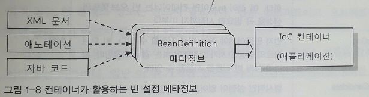
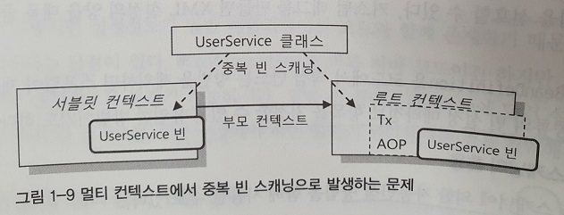

# 1.2 IoC/DI를 위한 빈 설정 메타정보 작성

1.2.1 빈 설정 메타정보 

- IoC 컨테이너의 가장 기본적인 역할은 코드를 대신해서 빈을 **생성**하고 **관리**하는 것임
- 빈을 만들기 위한 **설정 메타정보**는 파일이나 애노테이션 같은 리소스로부터 전용 리더를 통해 읽혀서 `BeanDefinition` 타입의 오브젝트로 변환됨
- `BeanDefinition`은 순순한 오브젝트로 표현되는 빈 생성 정보임
- 따라서 정보가 담긴 리소스의 종류와 작성 방식에 **독립적**임
- `BeanDefinition` 생성기를 사용할 수만 있다면, 빈 설정 메타정보를 담은 소스는 어떤 식으로 만들어도 상관 없음
    
    
    
- `BeanDefinition`에는 IoC 컨테이너가 빈을 만들 때 필요한 **핵심 정보**가 담겨 있음
- 몇 가지 필수 항목을 제외하면 컨테이너에 미리 설정된 **디폴트 값**이 그대로 적용됨
- `BeanDefinition`은 여러 개의 빈을 만드는 데 **재사용**될 수 있음
- 설정 메타정보가 같지만, 이름이 다른 여러 개의 빈 오브젝트를 만들 수 있기 때문임
- `BeanDefinition`에는 **빈 이름**이나 **아이디**를 나타내는 정보는 **포함되지 않음**
- 대신, IoC 컨테이너에 이 `BeanDefinition` 정보가 등록될 때 이름을 부여할 수 있음

1.2.2 빈 설정 메타정보 항목

- 빈 메타정보는 여러 가지가 있음
- 핵심 항목 몇 가지만 살펴볼 것임
    - 빈 메타정보 : `BeanDefinition`의 핵심 항목
        
        
        
- 스프링의 IoC/DI 기술은 단순하게 클래스로 오브젝트를 만들고 프로퍼티 설정하는 것이 전부가 아님
- 스프링은 오브젝트를 컨테이너가 생성하고 관리하는 과정에서 필요한 매우 세밀하고 유연한 방법을 제공함
- 빈 설정 메타 정보항녹 중에서 가장 중요한 것은 클래스 이름임
- 추상 빈으로 정의하지 않는 한 클래스 정보는 반드시 필요
    
    <aside>
    💡 추상 빈이 되면, 그 자체는 오브젝트가 생성되지 않고 다른 빈의 부모 빈으로만 사용됨
    
    </aside>
    
- 컨테이너에 빈의 메타 정보가 등록될 때 꼭 필요한 것은 클래스 이름과 함께 빈의 아이디 또는 이름임
- 일단 이 두 가지만 있으면 가장 간단한 빈 하나를 정의할 수 있음

1.2.3 빈 등록 방법

- 빈 등록은 빈 메타정보를 작성해서 컨테이너에게 건네주면 됨
- 가장 직접적이고 원시적인 방법은 `BeanDefinition`을 구현하는 것임
- 하지만 스프링을 확장해서 프레임워크를 만들거나, 내부 동작원리 학습 테스트 목적이 아니면 이 방법은 무리가 있음
- 그래서 보통 외부 리소스로 **빈 메타정보**를 작성하고, 이를 리더나 변환기를 통해 **애플리케이션 컨텍스트**가 사용할 수 있는 정보로 변환하는 방법을 사용함
- 대표적으로 **다섯 가지** 방법이 있음
    1. XML : <bean> 태그
    2. XML : 네임스페이스와 전용 테그
    3. 자동인식을 이용한 빈 등록 : 스테레오 타입 애노테이션과 빈 스캐너
    4. 자바 코드에 의한 빈 등록 : @Configuration 클래스의 @Bean 메소드
    5. 자바 코드에 의한 빈 등록 : 일반 빈 클래스의 @Bean 메소드

1.2.4 XML : <bean> 태그

- 다장 단순하면서도 가장 강력한 설정 방법임
- 스프링 빈 메타정보의 거의 모든 항목을 지정할 수 있어 세밀한 제어가 가능함
- 기본적으로 id와 class 두 개의 애트리뷰트가 필요함
    
    ```xml
    <bean id="hello" class="com.ksb....">
        ...
    </bean>
    ```
    
    <aside>
    💡 id는 생략할 수 있음
    
    </aside>
    
- <bean>은 다른 빈의 < property> 태그 안에 정의될 수 있음
- 이때, id를 지정하지 않음
- 이런 빈을 **내부 빈(Inner Bean)**이라 함
    
    ```xml
    <bean id="hello" class="com.ksb....">
        <property name="printer">
            <bean class="com.ksb....">
        </property>
    </bean>
    ```
    
- 내부 빈은 특정 빈에서만 참조하는 경우에 사용됨
- 아이디가 없으므로 다른 빈에서는 참조할 수 없음
- DI 이긴 하지만 특정 빈과 강한 결합을 가지고 등록괴는 경우 내부 빈을 사용함

1.2.5 XML : 네임스페이스와 전용 태그

- <bean> 태그 외에도 다양한 스키마에 정의된 전용 태그를 사용해 빈을 등록할 수 있음
- 스프링 빈을 분류하자면 크게 **핵심 코드**를 담은 컴포넌트와 **컨테이너 설정**을 위한 빈으로 구분할 수 있음
- 핵심 코드를 담은 빈은 보통 직접 만든 코드를 사용함
    
    ```xml
    <bean id="hello" class="com.ksb....">
    ```
    
- 반면에 AOP와 같은 컨테이너 설정정보 코드는 핵심 코드와 성격이 다름
    
    ```xml
    <bean id ="mypointcut" class="org.springframework.aop.aspectj.AspectJExpressionPointcut">
        <property name="expression" value="execution(* *..*ServiceImpl.upgrade*(..))">
    </bean>
    
    ```
    
- 문제는 설정정보를 담은 빈과 핵심 코드를 포함한 애플리케이션 3계층에 포함되는 빈이 동일한 <bean>태그를 사용하는 것임
- 범용적인 <bean>태그와 <property>로 이루어져 의도 파악이 어려움
- 스프링은 의미가 잘 드러나는 **네임스페이스**와 **태그**를 가진 설정 방법을 제공함
    
    ```xml
    <aop:pointcut id="mypointcut" expresssion="execution(* *..*ServiceImpl.upgrade*(..))">
    ```
    
- 내용이 분명하게 드러나고 선언 자체도 깔끔해짐
- 전용 태그는 동시에 여러 개의 빈을 만들 수 있다는 장점이 있음
- <context:annotation-config>는 보통 5개의 빈이 선언됨
- 즉, 태그 하나로 5개의 빈을 등록할 수 있다는 것임
- 스프링은 10여가지 네임스페이스와 수십 개의 전용 태그를 제공함
- 스프링이 제공하느 것 이외에도 커스텀 태그를 만드어 적용할 수 있음

1.2.6 자동인식을 이용한 빈 등록 : 스테레오 타입 애노테이션과 빈 스캐너

- XML을 통해 모든 빈을 일일이 선언하는 것이 귀찮을 수 있음
- XML과 같이 명시적으로 선언하지 않아도 스프링 빈을 등록하는 방법이 있음
- 특정 애노테이션이 붙은 클래스를 자동으로 찾아서 빈으로 등록하는 **빈 스캐닝(Bean Scanning)**이 있음
- 이런 스캐닝 작업을 담당하는 오브젝트를 **빈 스캐너(Bean Scanner)**라고 함
- 빈 스캐너는 지정된 클래스 패스 아래의 모든 패키지의 클래스를 대상으로 필터를 적용해 빈을 등록한 클래스를 선별함
    
    ```java
    @Component
    public class AnnotatedHello{...}
    ```
    
- 스프링에서 @Component를 포함해 **디폴트 필터**에 적용되는 애노테이션을 **스테레오타입(Stereotype)**이라 함
- `AnnotationConfigApplicationContext`는 @Component와 같은 스테레오타입 애노테이션이 붙은 클래스를 모두 찾아 빈으로 등록함
    
    ```java
    @Test
    public void simpleBeanScanning(){
        ApplicationContext ctx = 
            new AnnotationConfigApplicationContext("com.ksb.");
        AnnotatedHello hello = ctx.getBean("annotatedHello", AnnotatedHello.class);
        assertThat(hello, is(notNullValue()));
    }
    ```
    
- XML 파일은 단 한 줄도 만들지 않았지만, 하나의 빈이 완벽하게 등록됐음을 알 수 있음
- 기본적으로 빈의 이름은 클래스 이름의 맨 앞글자를 소문자로 변경한 것임.
- 빈의 이름은 클래스 이름과 다르게 지정할 수 도 있음
    
    ```java
    @Component("myAnnotatedHello")
    public class AnnotatedHello{...}
    ```
    
- 애노테이션을 부여하고 자동스캔을 통하면 개발 속도를 향상할 수 있음
- 반면에, 빈의 종류와 정의 등을 한 눈에 파악할 수 없다는 단점이 있음
- 또, 빈 스캔에 의해 자동등록되는 빈은 XML과 같이 상세한 메타정보 항목을 지정할  수 없고, 클래스당 한 개의 빈만 등록할 수 있음
- 대부분의 빈은 디폹트 메타정보 항목이면 충분하기 때문에 큰 문제가 되지는 않음
- 또한 빈 이름, 스코프, 지연 로딩 같은 **빈 메타정보 항목**은 스테레오타입 애노테이션의 앨리먼트나 기타 애노테이션을 이용해 변경할 수 있음
- 생상성을 위해 개발 시에 애노테이션을 통한 자동등록을 이용하다가, 실제 운영에서는 XML로 바꾸는 것도 좋은 전략임
- 빈 등록을 위한 스캐닝 작업은 지정돈 클래스패스 안의 모든 클래스에 대한 필터를 적용하는 방법으로 진행되기 때문에, 포인트컷을 적용할 클래스를 선정하지 않아도 됨
- 자동인식을 통한 빈 등록의 사용법은 크게 **두 가지**가 있음
    1. XML을 통한 빈 스캐너 등록
        - context **전용 태그**를 넣어서 간단히 빈 스캐너를 등록할 수 있음
            
            ```xml
            <context:componet-scan base-package="com.ksb.aop">
            ```
            
    2. 빈 스캐너를 내장한 애플리케이션 컨텍트 사용
        - 빈 스캐너를 **내장**한 컨텍스를 사용하는 방법임
        - 웹에서라면 `AnnotationConfigWebApplicationContext`를 루트 컨텍스트나 서블릿 컨텍스트가 사용하도록 파라미터를 변경하면 됨
            
            ```xml
            <context-param>
                <param-name>contextClass</param-name>
                <param-vlaue>
                    org.springframework.web.context.suppport.AnnotationConfigWebApplicationContext
                </param-vlaue>
            </context-param>
            
            <context-param>
                <param-name>contextConfigLocation</param-name>
                <param-vlaue>
                    com.ksb <!--패키지 여러개 지정 가능-->
                </param-vlaue>
            </context-param>
            ```
            
            <aside>
            💡 서블릿 컨텍스트라면 서블릿 안의 <init-param>을 이용해 동일한 정보를 설정하면 됨
            
            </aside>
            
        - 빈 클래스 자동 인식에는 @Component 외에도 표와 같은 스테레오타입 애노테이션을 사용할 수 있음
            
            
            | 스테레오타입 애노테이션  | 적용 대상 |
            | --- | --- |
            | @Repository | 데이터 액세스 계층의 DAO 또는 리포지토리 클래스에 사용됨. DataAccessException 자동변환과 같은 AOP의 적용 대상을 선정하기 위해서라도 사용됨 |
            | @Service | 서비스 계층의 클래스에 사용됨 |
            | @Controller | 프레젠테이션 계층의 MVC 컨트롤러에 사용됨. 스프링 웹 서블릿에 의해 웹 요청을 처리하는 컨트롤러 빈으로 선정됨 |
        - 자동인식을 위한 애노테이션을 이렇게 여러 가지 사용하는 데는 계층별로 빈의 특성이나 종류는 나태내려는 목적과 AOP 적용 대상 그룹을 만들기 위해서임
            
            <aside>
            💡 AOP 포인트컷 표현식을 사용하면 특정 애노테이션이 달린 클래스만 선정할 수 있음
            
            </aside>
            
        - 특정 계층으로 분리하기 힘든 경우 @Component를 사용하는 것이 바람직함
        - 스테레오 타입 애노테이션을 직접 정의해서 사용할 수 있음
            
            ```java
            @Traget({ElementType.TYPE})
            @Retention(RetentionPolicy.RUNTIME)
            @Document
            @Component
            public @interface BusinessRule{
                String value() default ""; //빈의 아이디 지정을 위해 선언
            }
            ```
            

1.2.7 자바 코드에 의한 빈 등록 : @Configuration 클래스의 @Bean 메소드

- Vol.1에서 오브젝트 생성과 주입을 담당하는 `DaoFactory`라 불리는 **오브젝트 팩토리**를 만들었었음
- 오브젝트 팩토리는 메소드 주입을 통해 의존관계를 만들어 준 것임
- 이 오브젝트 팩토리를 일반화해서 컨테이너로 만든 것이 지금의 스프링 컨테이너, 즉 **빈 팩토리**라 볼 수 있음
- 때로 스프링이 외부 리소스를 읽어 빈을 생성하는 것 보다, 오브젝트 팩토리를 직접 구현했을 때 처럼 **자바 코드**를 통해 오브젝트를 생성하고 DI 해주는게 유용할 때가 있음
- 코드로 빈 오브젝트를 생성하는 방법이라고 하면 `FactoryBean`을 구현해서 **팩토리 빈**으로 만드는 방법이 있었음
    
    <aside>
    💡 팩토리 빈은 스태틱 메소드로만 만들 수 있는 오브젝트를 빈으로 등록할 수 있게 해주는 장점이 있음[Vol.1 6.3 참고]
    
    </aside>
    
- 스프링은 직접 구현하는 것 보다 훨씬 편리하고 강력한 설정 기능을 제공함
- 팩토리 빈은 <bean> 태그를 이용해 빈으로 등록해야 함
- 또, 팩토리 빈당 하나의 빈만 정의할 수 있음
- 자바 코드에 의한 빈 등록은 하나의 클래스 안에 여러 개의 빈을 정의할 수 있음
    
    <aside>
    💡 여러개의 빈을 정의하면 빈마다 내부 값을 다르게 가져갈 수 있음
    
    </aside>
    
- 빈 설정 메타정보를 담고 있는 자바 코드는 @Configuration 애노테이션이 달린 크래스를 이용해 작성함
    
    ```java
    @Configuration
    public class AnnotatedHelloConfig{
        @Bean
        public AnnotatedHello annotatedHello() { //빈 메소드 하나 당 하나의 빈을 정의
            return new AnnotatedHello(); //리턴 오브젝트를 빈으로 등록함
        }
    }
    ```
    
- 의 생성자 파라미터로는 빈 스캐닝 대상 패키지 대신 @Configuration이 부여된 크랠스를 넣으면 됨
    
    ```java
    @Test
    public void simpleBeanScanning(){
        ApplicationContext ctx = 
            new AnnotationConfigApplicationContext(AnnotatedHelloConfig.class);
        AnnotatedHello hello = ctx.getBean("annotatedHello", AnnotatedHello.class);
        assertThat(hello, is(notNullValue()));
    }
    ```
    
- 빈으로 등록됐기 때문에, **싱글톤**으로 만들어짐
- @Configuration 클래스는 **빈 스캐닝**을 통해 자동등록 될 수 있음
- 자바 코드에 의한 설정은 XML과 같은 외부 설정파일을 이용하는 것 보다 유용한 점이 **네 가지**가 있음
    1. 컴파일러나 IDE를 통한 타입 검증이 가능함
    2. 자동환성과 같은 IDE 지우너 기능을 최대한 이용할 수 있음
    3. 이해하기 쉬움
    4. 복잡한 빈 설정이나 초기화 작업을 손쉰게 적용할 수 있음

1.2.8 자바 코드에 의한 빈 등록 : 일반 빈 클래스의 @Bean 메소드

- 자바 코드에 의한 빈 등록은 기존적으로 Configuration 애노테이션이 붙은 설정 전용 클래스를 이용함
- 하지만 일반 POJO 클래스에도 @Bean을 사용할 수 있음
    
    ```java
    //POJO 클래스
    public class HelloServie{
        ...
        @Bean
        public Hello hello{...}
    }
    ```
    
- 하지만, 일반 POJO 클래스에 @Bean을 사용하면 **싱글톤이 아님**
- @Configuration 클래스 안에서 사용된 @Bean만 싱글톤이 보장됨
- 이러한 이유 때문에 일반 POJO 클래스에서 DI 코드를 주의해서 작성해야 함
- 일반 POJO 클래스에서 싱글톤을 보장받기 위해서는 DI를 받아야 함
    
    ```java
    //POJO 클래스
    public class HelloServie{
        private Printer printer;
        public void serPrinter(Printer printer){
            this.printer = printer
        }
        
        @Bean
        public Hello hello{...}
    }
    ```
    
    <aside>
    💡 외부에서 printer을 사용할 수 없도록 private로 선언해야 함
    
    </aside>
    
- 이와 같이 일반 POJO 클래스에서 @Bean 메소드를 이용한 빈 메카정보 선언은, @Bean 메소드를 통해 정의되는 빈이 클래스로 만들어지는 빈과 **매우 밀접한 관계**가 있는 경우에 사용될 수 있음
- @Bean 메소드는 클래스 내부에 정의되어 멤버를 사용할 수 있고, 존재를 감출 수 있음
- 이렇게 밀접한 의존관계를 갖는 종속적인 빈을 정의할 때 유용하게 쓸 수 있음
- 하지만, 일반 애플리케이션 코드와 함께 존재하기 때문에 유연성이 떨어지는 단점이 있음

1.2.8 빈 등록 메타정보 구성 정략

- 위의 다섯 가지 방법 모두 장단점이 있고 사용하기 적절한 조건이 있음
- 한 가지 이상의 방법을 조합해 사용해도 되지만, 일관성 있게 사용하는 것이 중요함
- 자주 사용되는 설정 방법은 **세 가지**가 있음
    1. XML 단독 사용
        - 모든 빈을 명시적으로 XML에 등록하는 방법임
        - 등록 방법은 <bean> 태그를 이용하는 것과 스키마에 정의된 전용 태그를 이용하는 방법이 있음
        - XML에 모든 빈을 정의하고 등록한다고 해서 빈의 모든 메타정보를 XML 안에 넣을 필요는 없음
        - 자동으로 만들어지게 하거나, 애노테이션과 같이 별도의 메타정보를 통해 작성할 수 있음
        - 순수한 POJO 코드를 유지하고 싶다면 XML이 가장 좋은 선택임
        - 커스텀 스키마와 전용 태그를 만들어서 사용하는 경우에도 XML 단독 설정 방법을 선호할 수 있음
        - 모든 종류의 빈 설정 메타정보 항목을지정할 수 있는 **유일한 방법**임
    2. XML과 빈 스캐닝 혼용
        - 애플리케이션 3계층의 핵심 로직을 담고 있는 빈 클래스는 그다지 복잡한 빈 메타정보를 필요로 하지 않음
        - 대부분 싱글톤이며 클래스당 하나만 만들어지므로 빈 스캐닝에 의한 자동인식 대상으로 적정함
        - 자동인식 방식으로 등록하는 불편한 기술 서비스, 기반 서비스, 컨테이너 설정 등의 빈은 XML을 사용하면 됨
        - 개발이 진행되면서 만들어지는 애플리케이션 빈들은 스테레오타입 애노테이션을 부여해서 자동스캔으로 등록할 수 있으므로 XML파일에 손대지 않아도 됨
        - 단, 스캔 대상이 되는 클래스를 위치할 때 패키지를 미리 결정해둬야 한다는 점을 주의해야 함
        - 웹 기반의 스프링 애플리케이션에는 보통 **두 개**의 애플리케이션 컨텍스트가 등록되서 사용됨
            
            <aside>
            💡 하나는 서블릿 컨텍스트 이고, 다른 하나는 루트 컨텍스트임
            
            </aside>
            
        - 빈 스캐닝은 애플리케이션 별로 각각 진행되는 작업임
        - XML이라면 알아서 각각 컨텍스트에 속한 빈을 등록하면 되겠지만, **빈 스캐닝**은 한 번에 **최상위 패키지를 지정**해서 하는 것이니 자칫하면 양쪽 컨텍스트의 빈 스캐너가 같은 클래스를 **중복해서 빈으로 등록**해버릴 수 있음
            
            
            
        - 위 그림의 `UserService`는 **루트 컨텍스트**에서 **트랜잭션**이 적용된 채로 사용돼야 함
        - 컨텍스트 계층구조에서 빈을 찾을 때는 자신의 컨텍스트를 먼저 검색하고, 없을 때만 부모 컨텍스트를 찾음
        - `UserService`는 서블릿 컨텍스트에 만들어진 **빈**을 찾았고, 더이상 검색하지 않기 때문에 루트 컨텍스트에 접근하지 못하여 트랜잭션이 적용되지도 않음
        - 트랜잭션 없이 정상적인 상황에서는 기능에 문제가 없는 것 처럼 보임
        - 하지만 예외상황에서야 오류를 알 수 있고, 상당히 찾기 힘든 미묘한 버그가 만들어진 것이기 때문에 원인을 찾기 쉽지 않음
        - 웹 애플리케이션의 이중 컨텍스트 계층 구조와 빈 검색 우선순위를 잘 이애해서 중복 등록 문제가 발생하지 않도록 해야 함
        - XML과 빈 스캐닝을 사용하는 경우, XML을 사용하는 애플리케이션 컨텍스트를 기본으로하고 빈 스캐너를 context 스키마를 사용하면 됨
            
            ```xml
            <context:componet-scan base-package="com.ksb.aop">
            ```
            
        - <context:componet-scan>을 이용하면 자바 코드에 의한 설정 방식을 함께 적용할 수 있음
        - @Configuration이 붙은 클래스를 빈 스캔 대상으로 만들거나 직접 <bean> 태그에 등록하면 됨
        - 하지만, XML을 통해 고급 빈 설정이 가능하니 자바 코드에 의한 설정을 추가한다 해서 얻을 수 있는 이점은 많지 않음
    3. XML 없이 빈 스캐닝 단독 사용
        - XML 없이 자동 스캔만으로 모든 빈 등록할 수 있음
        - 이때는 **자바 코드에 의한 빈 등록** 방법이 반드시 필요함
        - @Configuration 클래스를 모두 빈 스캔 대상에 포함시킴
        - 이 방식을 웹 애플리케이션에 적용하려면 루트 컨텍스트와 서블릿 컨텍스트 모두 contextClass 파라미터를 추가해 `AnnotationConfigWebApplicationContext`로 컨텍스트 클래스를 변경해줘야 함
        - contextLocations 파라미터에는 스캔 대상 패키지를 넣어야 함
        - 이 방법의 장점은 모든 빈의 정보가 자바 코드에 담겨 있으므로 타입에 안전한 방식으로 작성할 수 있음
        - 가장 큰 단점은 스키마에 적용된 전용 태그를 사용할 수 없다는 것임
        

1.2.9 빈의 의존관계 설정 방법

- DI를 위한 의존관계 메타정보 작성 방법임
- 빈 사이의 의존관계 메타정보를 작성하는 방법은 여러 가지 기준으로 분류할 수 있음
- DI할 대상을 선정하는 방법으로 분류해보면 **명시적**인 방법과 일정 **규칙**에 따라 자동으로 선정하는 방법으로 나눌 수 있음
- 일정 규칙은 주로 타입을 비교하는 방법을 사용하고, 이를 **자동와이어링(Autowiring)**이라 함
- 빈 등록 방식과 빈 의존관계 주입 방법은 메타정보 작성 방법이 하상 같아야 하는 게 아님
- 예를 들어 <bean> 태그를 사용해 빈을 등록하고, 그 의존관계 정보는 애노테이션으로 작성할 수 있음
- 일반적으로 DI라고 하면 스프링이 관여하는 빈 오브젝트 사이의 관계를 말하지만, 넓게 보자면 빈 외의 오브젝트 또는 단순 값을 **주입**하는 것도 포함함

1.2.10 XML : <property>, <constructor-arg>

- <bean>을 이용해 빈을 등록했다면 **두 가지** 방식으로 DI를 지정할 수 있음
    1. 프로퍼티
    2. 생성자
- 프로퍼티는 자바빈 규약을 따르는 수정자 메소드를 사용함
- 생성자는 빈 클래스의 생성자를 이용하는 방법임
- 두 가지 방법 모두 파라미터로 **의존 오브젝트** 또는 **값**을 **주입**함

1.2.11 <property> : 수정자 주입

- 수정자를 통해 의존관계의 빈을 주입하려면 <property> 태그를 사용할 수 있음
- ref 애트리뷰트를 사용하면 빈의 이름을 이용해 주입할 빈을 찾음
    
    ```xml
    <bean ...>
        <property name="printer" ref="defaultPrinter" />
    <bean>
    ```
    
- value 애트리뷰트를 사용하면 단순 값 또는 빈이아닌 오브젝트르 주입할 때 사용함
    
    ```xml
    <property name="name" value="Spring" />
    <property name="myClass" value="java.lang.String" />
    ```
    
- value 애트리뷰트는 값을 수정자의 타입에 맞게 적절히 변환을 시도함
- 적절한 변환기를 컨테이너에 등록하면 어떤 오브젝트도 value 애트리뷰트의 값으로부터 생성해서 프로퍼티에 주입할 수 있음
- XML의 <property>에는 해당 프로퍼티의 타입정보가 나타나지 않기 때문에, 타입이 호환되는지 주의르 기울여서 작성해야 함

1.2.12 <constructor-arg> : 생성자 주입

- 생성자를 통한 빈 도는 값의 주입에 사용됨
- 생성자의 파라미터를 이용하기 때문에, 한 번에 여러 개의 오브젝트를 주입할 수 있음
- 대신 파라미터 순서나 타입을 명시하는 방법이 필요함
    
    ```xml
    <bean id="hello" class="com.ksb...">
        <constructor-arg index="0" value="Spring" />
        <constructor-arg index="1" ref="printer" />
    </bean>
    ```
    
    ```xml
    <construct-arg type="java.lang.String" value="Spring" />
    <construct-arg type="com.ksb.Printer" ref="printer" />
    ```
    
- 생성자의 파라미터 개수가 많고 비슷한 타입이 있어 혼란이 있는 경우를 위해 생성자 파라미터 이름을 지정하는 방법도 제공함
    
    ```xml
    <construct-arg name="name" value="Spring" />
    <construct-arg name="printer" ref="printer" />
    ```
    

1.2.13 XML : 자동와이어링

- XML 문서의 양을 대폭 줄일 수 있는 획기적인 방법임
- 하지만, 그만큼 위험도가 따르기 때문에 주의를 기울여야 함
- 프로퍼티나 생성자 파라미털르 지정하지 않고 미리 정해진 규칙을 이용해 자동으로 DI 설정을 컨테이너가 추가하도록 만드는 것임
- byName : 빈 이름 자동와이어링
    - 보통 관례에 따라 빈의 이름은 클래스의 이름이나 빈이 구현한 대표적인 인터페이스 이름을 따름
        
        ```xml
        <bean id="hello" class="...">
            <property name="name" ref="Spring" />
            <property name="printer" ref="printer" />
        </bean>
        
        <bean id="printer" class="...StringPrinter" />
        ```
        
    - 빈 이름 자동와이어링은 이런 관례를 이용한 방법임
    - autowired 모드를 지정하면 <property name="printer" ref="printer" />를 생략할 수 있음
        
        ```xml
        <bean id="hello" class="..." autowired="byName">
            <property name="name" ref="Spring" />
            <!--<property name="printer" ref="printer" />는 컨테이너가 자동으로 추가-->
        </bean>
        
        <bean id="printer" class="...StringPrinter" />
        ```
        
    - 이름과 동일한 빈을 찾아서 자동으로 **프로퍼티**로 등록함
    - 프로퍼티와 이름이 같은 빈이 없는 경우는 무시됨
    - 설정 파일 모든 빈에 적용할 것이라면 루트 태그인 <beans>의 디폴트 자동와이어링 옵션을 변경해줘도 됨
        
        ```xml
        <beans default-autowire="byName">
            ...
        </beans>
        ```
        
- byType : 타입에 의한 자동와이어링
    - 프로퍼티 타입과 각 빈의 **타입**을 비교해서 자동으로 연결하는 방법임
        
        ```xml
        <bean id="hello" class="..." autowire="byType">...</bean>
        <bean id="mainPrinter" class="...StringPrinter">
        ```
        
    - 타입에 의한 방식은 빈의 이름이나 프로퍼티 이름에 신경을 쓰지 않아도 됨
    - 하지만, 타입이 같은 빈이 두 개 이상 존재하면 적용되지 못함
    - 또한 자동와이어링은 빈의 모든 프로퍼티에 **일괄 적용**되기 때문에, 프로퍼티 개수가 많아지면 자동와이어링 대상이 아님에도 한 번씩 **모든 빈의 타입과 비교**되는 작업이 발생되기 때문에 이름에 의한 자동와이어링에 비해 속도가 **느림**
    - 생성자에 자동와이어링을 적용 하려면 autowire=”constructor” 애트리뷰트를 이용하면 됨
- 자동와이어링은 XML 설정파일의 양을 대폭 줄여줄 수 있는 획기적인 방법임
- 하지만, 단점도 있음
- 자동와이어링 방식은 자동으로 의존관계 정보를 생성하기 때문에, XML만 봐서 빈 사이의 의존관계를 알기 힘듦
- 또한, 오타로 빈 이름을 잘못 적으면 DI 되지 않고 넘어갈 위험이 있음
- 마지막으로, 하나의 빈에 대해 한 가지 자동와이어링 방식밖에 지정할 수 없음
- 프로퍼티가 많더라도 일부는 **타입**으로, 일부는 **이름**으로 자동와이어링되게 만들 수 없음
- DAO나 서비스 계층의 경우 타입에 의한 자동와이어링이 편함
- 반면에 기술 서비스나 기반 서비스 빈의 경우 동일 **타입**의 빈이 하나이상 등록될 가능성이 많기 때문에 **이름**에 의한 자동와이어링을 적용하는 편이 좋음

1.2.14 XML : 네임스페이스와 전용 태그

- 스키마를 정의해서 사용하느 전용 태그의 의존관계 지정은 단순하지 않음
- <property> 또는 <constructor-arg> DI용 태그가 고정되어 있지 않고, 태그 하나당 몇 개의 빈이 만들어지고 이름이 무엇인지 명확하지 않기 때문임
- 관례적으로 전용 태그에 의해 만들어지는 빈을 다른 빈이 참조하는 경우 id 애트리뷰트를 사용해 빈의 아이디를 지정함
    
    ```xml
    <oxm:jax2-marshaller id="unmarshaller" contextPath="..." />
    ```
    
- 이를 다른 빈에 DI할 때 ref 값으로 넣으면 됨
    
    ```xml
    <property name="unmarshaller" ref="unmarshaller">
    ```
    
- 일반적으로 스프링 전용 태그는 보통 -ref로 끝나는 애트리뷰트를 이용해 DI 할 빈을 지정하는 **관례**가 있음
- AOP 어드바이저 빈인 <aop:advisor> 처럼 -ref가 붙는 경우와 붙지 않는 경우에 분명한 차이가 있으니 주의해야 함
    
    ```xml
    <aop:config>
        <aop:advisor advice-ref="reansactionAdvice" pointcut="bean(*Service)"/>
    </aop:config>
    <bean id="transactionAdvice" .../>
    ```
    
- 빈의 아이디와 레퍼런스를 명시적으로 선언하는 방식으로 사용하다면 네임스페이스를 쓰는 전용 태그도 간단히 의존관계를 정의할 수 있음
- 다만 상당수의 전용 태그는 컨테이너가 참조하는 설정정보롬나 사용되기 때문에 아이디 선언조차 하지 않는 경우가 많음
- 전용태그도 내부적으로 <bean>으로 선언한 것과 동일하게 빈 메타정보가 만들어지므로 자동와이어링의 대상이 될 수 있음
- 하지만, 기술 서비스나 기반 서비스의 경우 가능한 id를 이용해 명시적으로 선언하는 것이 좋음

1.2.15 애노테이션 : @Resource

- @Resource는 <property> 선언과 비슷하게 준비할 빈을 **아이디**로 지정하는 방법임
- **수정자**뿐만이 아니라 **필드**에 DI할 수 있음
- 수정자
    
    ```java
    public class Hello{
        private Printer printer;
        @Resource(name="printer") //<property name="printer" ref="printer"> 동일
        public void setPrinter(Printer printer){
            this.printer=printer;
        }
    }
    ```
    
    - @Resource는 XML의 <property> 태그와 대응된다고 볼 수 있음
    - 자바빈의 수정자 메소드의 관레에 따라 메소드 이름으로부터 프로퍼티 이름을 끌어낼 수 있기 때문에 name=”printer”로 충분
    - @Resource와 같은 애노테이션으로 된 의존관계 정보를 이용해 DI가 이뤄지게 하려면 세 가지 방법 중 하나를 선택해야 함
        1. XML의 <context:annotation-config />
        2. XML의 <context:component-scan />
        3. `AnnotationConfigApplicationContext` 또는 `AnnotationConfigWebApplicationContext`
    - <context:annotation-config />는 @Resource와 같은 애노테이션 의존 관계 정보를 읽어서 메타정보를 추가해주는 기능을 가진 **빈 후처리기**를 등록해주는 전용 태그임
        
        ```xml
        <beans xmlns="..."
               xsi:schemaLocation="http://www.springframework.org/schema/context
                http:http://www.springframework.org/schema/context/spring-context-3.0.xsd">
            <context:annotation-config />
        </beans>
        ```
        
        - <context:annotation-config />에 의해 빈 후처리기는 AOP의 자동 프록시 생성기처럼 새로운 빈을 등록해주지 않음
        - 대신 이미 등록된 빈의 메타정보에 프로퍼티 항목을 추가해주는 작업을 함
    - <context:component-scan />은 XML안에 **빈 스캐닝**을 이용하는 경우에 사용함
        
        ```xml
        <context:component-scan base-package="com.ksb...." />
        ```
        
        - 빈 스캐닝은 항상 애노테이션 의존관계 설정을 지원한다고 기억하면 됨
- 필드
    
    ```java
    @Component
    public class Hello {
        @Resource(name="printer")//참조할 빈의 이름 지정. 생략 가능
        private Printer printer;
        // 수정자 메소드 없음
    }
    ```
    
    - private 가능
    - 이런 방법을 **필드 주입(Filed Injection)**이라 함
    - 수정자가 없다면 코드는 간결해짐
    - 하지만, 단위 테스트가 필요한 클래스에 수정자 메소드가 필요하므로 바람직하지 못함
    - 또한, 수정자에서 다른 작업을 하는 경우 필드 주입을 사용하면 안됨
    - 통합 테스트인 경우 필드 주입을 사용해도 별로 문제가 되지 않음
- 애노테이션의 장점은 소스코드와 함계 있기 때문에 각종 타입과 이름 등의 메타정보를 이용해 **디폴트 설정**을 쉽게 만들 수 있다는 것임
- 자동으로 프로퍼티 이름과 참조할 빈 이름을 결정한다는 명에서 XML에서 사용하는 이름을 이용한 자동와이어링과 비슷하게 보이기도 함
- 하지만 차이점이 있음
- XML은 프로퍼티에 주입할 만한 후보 빈이 없으면 무시하고 넘어가는 반면, 애노테이션은 코드와 관례를 이용하여 DI 적용 여부를 프로퍼티마다 세밍하게 제어할 수 있음
- 디폴트 이름으로 참조할 빈을 찾을 수 없는 경우 타입을 이요해 다시 한번 빈을 찾기도 함
- 하지만 권장하지 않음
- @Resource를 사용는 경우는 드물지만 빈에서 애플리케이션 컨텍스트에 접근해야할 때 사용됨
    
    ```java
    @Resource
    ApplicationContext context;
    ```
    

1.2.16 애노테이션 : @Autowired

- @Resource와 사용 방법이 비슷함
- @Resource와 차이점은 이름 대신 필드나 프로퍼티 **타입** 이용해 후보빈을 찾는다는 것임
- @Autowired는 XML의 타입에 의한 자동와이어링 방식을 **네 가지**로 확장 한 것임
    1. 생성자
        
        ```java
        public class BaseSqlService implements SqlService{
            @Autowired //단 한 개의 생성자에만 부여 가능
            public BaseSqlService(SqlReader sqlReader, SqlRegistry sqlRegistry){
                this.sqlReader=sqlReader;
                this.sqlRegistry=sqlRegistry;
            }
        }
        ```
        
        - 생성자는 여러 값을 한 번에 주입받을 수 있지만, 한 개의 생성자에만 사용할 수 있다는 단점이 있음
    2.  필드 
        
        ```java
        public class Hello{
            @Autowired
            private Printer printer;
        }
        ```
        
    3. 수정자 메소드
        
        ```java
        public class Hello{
            private Printer printer;
            @Autowired
            public void setPrinter(Printer printer){
                this.printer=printer;
            }
        }
        ```
        
    4.  일반 메소드
        
        ```java
        public class BaseSqlService implements SqlService{
            @Autowired
            public config(SqlReader sqlReader, SqlRegistry sqlRegistry){
                this.sqlReader=sqlReader;
                this.sqlRegistry=sqlRegistry;
            }
        }
        ```
        
        - 일반 메소드 주입은 애노테이션 방식의 **고유한 기능**임
        - 여러 메소드에 @Autowired 부여 가능
        - 일반 메소드를 통한 DI는 XML을 통해서 의존관계를 설정할 수 없음
- @Autowired는 기본적으로 타입에 의해 빈을 찾음
- 중복된 타입의 빈이 존재한다고 이름을 통해 빈을 찾는 @Resource를 사용할 필요는 없음
    - **컬렉션과 배열**을 사용하면 같은 타입의 빈이 하나 이상 존재해도 @Autowired를 사용하여 빈을 여러개 DI 받을 수 있음
        
        ```java
        @Autowired Collecgtion<Printer> printers;
        @Autowired Printer[] printers;
        @Autowired Map<String, Printer> printerMap;
        
        ```
        
        - 컬렉션과 배열을 단지 같은 타입의 빈이 여러 개 등록되는 경우에 충돌을 피하려고 사용하면 안됨
        - 의도적으로 같은 여러 개의 빈을 등록하고 이를 모두 참조하거나 선별적으로 필요한 빈을 찾을 때 사용하는 것이 좋음
        - 한 가지 주의사항은 DI 할 빈의 타입이 컬렉션인 경우 @Autowired로 자동 설정이 불가능하다는 점임
        - 빈 자체가 컬렉션인 경우 @Resource를 이용해야 함
    - **@Qualifier**는 **한정자**라 불리고, 타입 외의 정보를 추가해서 자동와이어링을 세밀하게 제어 할 수 있는 보조적인 방법임
        - 타입만으로 원하는 빈을 지정하기 어려운 경우에 사용할 수 있음
        - 두 개의 DB를 사용하는데, 둘 다 `Datasource` 타입인 경우가 이에 해당함
            
            ```xml
            <bean id="oracleDataSource" class="...XxxDataSource">...</bean>
            <bean id="mysqlDataSource" class="...YyyDataSource">...</bean>
            ```
            
        - @Qualifier라는 빈 선정을 도와주는 부가 정보를 이용하는 것이 좋음
            
            ```java
            @Autowired
            @Qualifier("mainDB")
            DataSource dataSource;
            ```
            
            ```xml
            <bean id="oracleDataSource" class="XxxDataSource">
                <qualifier value="mainDB">
            </bean>
            ```
            
            <aside>
            💡 두 가지 설정이 완료되면 스프링은 DataSource 타입 중에서 <qualifier> 태그가 있고, 그 값이 mainDB인 것으로 “한정”해서 자동 와이어링을 시도함
            
            </aside>
            
        - @Component를 이용하는 경우 XML에서 빈을 만들지 않아도 됨
            
            ```java
            @Component
            @Qualifier("mainDB")
            public class OracleDataSource{...}
            ```
            
        - 커스텀 한정자 애노테이션을 만들어 좀 더 의미있게 만들 수 있음
            
            ```java
            @Target({ElementType.FIELD, ElementType.PARAMETER})
            @Retention(RetentionPolicy.RUNTIME)
            @Qualifier
            public @interface Database{
                String value();
            }
            ```
            
            ```java
            @Autowired
            @Database("main")
            DataSource dataSource;
            ```
            
        - @Qualifier는 부여 대상이 필드, 수정자, 파라미터 뿐임
        - 생성자와 일반 메소드의 경우 @Quaifier를 부여하는 것이 의미가 없음
        - 각 파라미터 당 하나의 빈이 매핑되기 때문에 이때는 생성자나 메소드가 아니라 파라미터에 직접 부여해야 함
            
            ```java
            @Autowired
            public void config(@Qualifier("mainDB") DataSource dataSource, Printer printer{...})
            ```
            
- @Autowired는 @Resource와 마찬가지로 일단 지정하면 반드시 DI 할 후보 빈이 존재해아 함
- 만약 반드시가 아닌 선택적 DI를 원한다면 required 엘리먼트를 false로 선언하면 됨
    
    ```java
    @Autowired(requried=false) Printer printer;
    ```
    

1.2.17 애노테이션 : @Injection

- @Autowired는 스프링 2.5부터 적용된 스프링 전용 애노테이션임
- @Injection은 JavaEE 6의 표준 스펙인 JSR-330에 정의된 애노테이션임
- @Autowired의 @Qualifier와 @Injection의 @Qualifier는 다름

1.2.18 @Autowired와 getBean()

- @Autowired는 가장 유연하면서 가장 강력한 기능을 가진 의존관계 설정 방법임
- 같은 타입이 여러개 존재해서 @Qualifier를 쓰거나 어쩔 수 없이 @Resource를 사용해야 하지만, 대개 클래스나 인터페이스당 하나의 빈이 등록되므로 @Autowired만으로 충분함
- getBean()은 기본적으로 Object 타입을 반환함
- 때문에, 제네릭 메소드를 이용해 타입 파라미터를 주는 방법을 선호함
    
    ```java
    Printer printer = ac.getBean("myprinter", Printer.class);
    ```
    
- 특정 타입의 빈이 **하나만 존재**한다면, @Autowired처림 이름 대신 **타입**을 이용해 빈을 찾을 수 있음
    
    ```java
    Printer printer = ac.getBean(Printer.class);
    ```
    
    <aside>
    💡 같은 타입의 빈이 여러개면 에러 발생
    
    </aside>
    

1.2.19 스프링 테스트

- 테스트를 위해 매번 빈 클래스를 만들고 XML을 만들거나 빈 스캐닝을 위해 별도의 패키지를 구성하는 작업은 번거로움
- 그래서 테스트 클래스 안에 스태틱 멤버 클래스로 애노테이션이 달린 클래스를 등록하고 이를 XML 없이 **직접 컨텍스트 빈으로 등록**해서 사용하는 방법이 유용함
    
    ```java
    @Test
    public void simpleAtAutowired(){
        //빈 클래스를 직접 지정
        AbstractApplicationContext ac = 
            new AnnotationConfigApplicationContext(BeanA.class, BeanB.class);
        BeanA beanA = ac.getBean(BeanA.class)
        assertThat(beanA.beanB, is(notNullValue()));
    }
    
    //빈 스캔을 할 것이 아니기 때문에 @Component는 필요 없음
    //빈 이름을 지정할 필요가 있으면 @Component("beanName") 또는 @Named("beanName")을 붙이면 됨
    private static class BeanA{
        @Autowired BeanB beanB;
    }
    private static class BeanB{}
    ```
    

1.2.20 자바 코드에 의한 의존관계 설정

- @Configuration과 @Bean을 잉요해서 자바 코드로 빈을 등록하는 경우에 빈의 의존관계를 설정하는 방법임
- **세 가지** 방법이 있음
    1. 애노테이션에 의한 설정 @Autowired, @Resource
        - 빈의 오브젝트만 생성해서 등록하면 의존관계는 설정용 후처리기에 의해 별도로 설정될 것임
            
            ```java
            @Configration
            public class Hello {
                @Bean public Hello hello(){ return new Hello(); }
                @Bean public Printer printer(){ return new Printer(); }
            }
            ```
            
        - @Autowired와 같은 **애노테이션** 의존관계 설정은 빈 오브젝트 등록을 마친 후에 **후처리기**에 의해 별도의 작업으로 진행됨
            
            ```java
            public class Hello{
                @Autowired Printer printer;
            ```
            
        - 때문에, 의존관계 설정을 XML이나 다른 방법을 사용할 수 있음
    2. @Bean 메소드 호출
        - 메소드로 정의된 다른 빈을 **메소드 호출**을 통해 **참조**하는 것임
        - @Bean이 붙은 메소드 자체가 하나의 빈 이름처럼 사용 됨
            
            ```java
            @Configration
            public class Config {
                @Bean public Hello hello(){ 
                    Hello hello = new Hello();
                    hello.setPrinter(printer());
                    return hello
                }
            
                @Bean public Printer printer(){ return new Printer(); }
            }
            ```
            
        - 일종의 수동 DI 방식임
        - 이 방법은 자바 코드로 DI 하는 가장 **직관적인 방법**임
        - **싱글톤**으로 만들어지기 때문에 한 개의 오브젝트가 반복적으로 사용 됨
        - @Configration이 붙지 않으면 싱글톤으로 만들어지지 않기 때문에 주의해야 함
    3. @Bean과 메소드 자동와이어링
        - 직접 빈 메소드를 호출하지 않고, 빈의 **레퍼런스**를 **파라미터**로 주입받는 방식을 사용함
            
            ```java
            @Configration
            public class Config {
                @Bean public Hello hello(Printer printer){ 
                    Hello hello = new Hello();
                    hello.setPrinter(printer);
                    return hello
                }
            
                @Bean public Printer printer(){ return new Printer(); }
            }
            ```
            
        - @Bean이 붙은 자바 코드에 의한 설정용 메소드에 애노테이션을 이용한 의존관계 설정 기법을 적용한 것임
        - 빈에 적용되는 DI가 아니라 빈 설정정보로서의 메소드에 의해 적용되는 DI임
        - 설정 메타정보가 자바 오브젝트이므로 DI 대상에 포함되도록 만든 것임
        - @Configuration이 붙은 Config도 하나의 빈이고 @Bean이 @Autowired를 포함하고 있다고 생각하면 이해하기 쉬움
        - 이 방식의 장점은 다른 빈의 레퍼런스를 메소드 호출이 아니라 **파라미터**로 받기 때문에, @Bean 메소드 호출을 이용했을 때 보다 자바 코드가 자연스럽다는 것임
        - 이 방법은 일반 @Autowired와 마찬가지로 @Qualifier를 파라미터에 추가할 수 있음
        - 또, 한 개 이상의 파라미터를 사용할 수 있음
        - Config 클래스 내의 여러 @Bean 메소드에서 참조되는 빈 오브젝트라면 , **클래스 레벨**의 DI를 통해 가져와도 됨
    

1.2.21 빈 의존관계 설정 전략

- 빈 등록 방법도 여러가지이지만 빈 의존관계 설정은 그보다 더 다양함
- 어떤 방식을 사용할지는 전적으로 개발자의 자유임
- 정책 또는 가이드라인을 잘 만들어두는게 중요함
- 자주 쓰이는 방법은 **세 가지**가 있음
    1. XML 단독
        - 빈 등록은 물론이고 의존관계 설정까지 모두 XML만으로 구성하는 방법임
        - XML을 사용하다 하더라도 모든 정보를 명시적으로 선언하지 않아도 됨
        - 자동와이어링을 사용하는 것이 좋음
        - XML의 자동와이어링은 **이름**에 의한 방식이 좋음
        - 타입에 의한 방식은 @Autowired 애노테이션을 이용하는 세밀한 방식과는 달리 불편하고 느림
        - 가능하면 **엄격**하고 **일관성** 있는 **명명 규칙**을 클래스 이름과 빈 이름에 적용해야 함
    2. XML과 애노테이션 설정의 혼합
        - 빈은 XML로 등록하지만 의존관계 정보는 @Autowired나 @Resource 같은 애노테이션을 이용하는 방법도 자주 사용됨
    3. 애노테이션 단독
        - 빈의 등록도 @Component 애노테이션을 이용해 **스캐너**에게 맡기고, 의존관계 역시 @Autowired와 같은 **애노테이션**을 이용해 자동으로 등록하는 방법임
        - XML이 하나도 없는 순수한 애노테이션만의 설정을 원한다면 일부 기술 서비스 빈은 @Configration 자바 코드를 이용해 등록해줘야 함
    

1.2.22 프로퍼티 값 설정 방법

- DI를 통해 빈에 주입되는 것은 **두 가지**임
    1. 레퍼런스
    2. 단순 값
- 사실 스프링에서 말하는 **값**이란, 스프링이 관리하는 빈이 아닌 모든 것을 말함
- 따라서 복잡한 오브젝트도 설정 메타정보에 의해 **런타임** 시 빈에 **주입**된다면 역시 값이라 할 수 있음
- 보통 **싱글톤**은 **동시성** 문제 때문에 필드 값을 함부로 수정하지 않음
- 싱글톤을 상태가 없는 방식으로 만들기 때문에 필드에 있는 값은 **읽기전용**인 경우가 대부분임
- 값 주입 방법 **세 가지**가 있음
    1. XML : <proeprty>와 전용 태그
        - <property>는 ref 애트리뷰트를 이용해 다른 빈의 아이디를 지정함
        - 만약 ref 대신 value 애트리뷰트를 사용한다면 런타임 시에 주입할 값으로 인식함
            
            ```java
            <bean id="hello">
                <!--public setName(String name)메소드를 호출래서 값을 주입 함-->
                <property name="name" value="Everyone">
            </bean>
            ```
            
        - XML의 value 애트리뷰트 값이 스트링이기 때문에, 다른 타입이면 적절한 변환이 필요함
    2. 애노테이션 : @Value
        - 코드와 외부 설정을 분리해서 얻을 수 있는 가장 큰 장점은 설정이 바뀌더라도 소스코드를 다시 컴파일하지 않아도 된다는 점임
        - 특히 값의 경우 빈의 의존관계와는 달리 자동와이어링 같은 방법이 없기 때문에 항상 **명시적**으로 지정해야 함
        - 따라서 값을 넣을 때는 XML과 같은 외부 설정 리소스를 사용하는 것이 마땅함
        - 소스코드의 @Value 애노테이션을 이용해 프로퍼티 값을 지정할 수 있음
            
            ```java
            public class Hello{
                private String name;
                @Value("Everyone")
                public void setName(String name){
                    this.name=name;
                }
            }
            ```
            
        - @Value는 직접 필드 값을 초기화 할 때와 분명한 차이가 있음
        - @Value 애노테이션은 스프링 컨테이너가 **참조**하는 정보이지, 그 자체로 클래스의 필드에 값을 넣어주는 기능은 아님
        - 따라서 테스트 코드와 같이 컨테이너 밖에서 사용된다면 @Value 애노테이션은 무시됨
        - XML과 같이 외부로 분리하는 방법에 비해 @Value에 직접 값을 지정하는 방법은 잘 사용되지 않음
        - 환경정보나 프로퍼티 파일에서 값을 가져오는 방법을 많이 사용함
        - 프로퍼티 파일을 만들고 해당 값을 가져오는 방법을 많이 사용함
            
            ```java
            @Value("${database.username}")
            String username;
            ```
            
            ```java
            <context:property-placeholder location="classpath:database.properties"/>
            ```
            
            <aside>
            💡 XML에 프로퍼티 파일을 지정해야 함
            
            </aside>
            
    3. 자바 코드 : @Value
        - @Configuration과 @Bean을 사용하는 경우에도 프로퍼티 값을 외부로 독립시킬 수 있음
        - 클래스 자체가 메타정보이기 때문에, 설정을 변경해야 할 때마다 코드를 수정하고 재컴파일하는 게 문제가 되지 않음
        - 하지만, 프로퍼티 파일에서 가져오는 것이 바람직함
        - 자바 코드에 의한 설정에서도 @Autowired를 활용했던 것 처럼 @Value도 사용 가능 함
            
            ```java
            @Configuration
            public class Config{
                @Value("${database.usernmae}")
                private String name;
                @Bean public Hello hello(){
                    Hello hello = new Hello();
                    hello.setName(this.name);
                    return hello;
                }
            }
            ```
            
        - 또는 @Bean 메소드의 파라미터에 @Value를 직접 사용할 수 있음
            
            ```java
            @Bean public Hello hello(Value("${database.username}") String name){
                Hello hello = new Hello();
                hello.setName(this.name);
               return hello;
            }
            ```
            
- 메타정보 종류에 따른 값 설정 방법은 **네 가지**가 있음
    1. PropertyEditor와 ConversionService
        - 프로퍼티 타입이 String이면 아무런 문제가 없지만, 그 외의 타입인 경우라면 타입을 변경하는 과정이 필요함
        - 스프링은 두 가지 동류의 타입 변환 서비스를 제공함
            1. PropertyEditor
                - `PropertyEditor`는 디폴트로 사용되는 타입 변환기임
                - 기본타입
                    - 스프링의 내장 프로퍼티 에디터는 **열 아홉**가지의 **기본 타입 변환**을 지원함
                        
                        <aside>
                        💡 boolean, Boolean, byte, Byte, short, Short, int, Interger, long, Long, float, Float, double, Double, BigDecimal, BigInteger, char, Character, String
                        
                        </aside>
                        
                    - XML 선언
                        
                        ```xml
                        <property name="flag" value="true"> <!--boolean flag-->
                        ```
                        
                    - 애노테이션 선언
                        
                        ```java
                        @Value("1.2") double rate;
                        ```
                        
                        <aside>
                        💡 항상 문자열로 만들어 넣어야 함
                        
                        </aside>
                        
                - 배열
                    - 기본 타입의 배열로 선언된 프로퍼티에는 한 번에 배열의 값을 주입할 수 있음
                    - 값을 **콤마**로 구분해서 넣으면 됨
                        
                        ```java
                        @Value("1,2,3,4") int[] intarr;
                        ```
                        
                - 기타
                    - 스프링은 기본 타입 외에도 타입 변환을 지원함
                    - 보통 설정을 통해 외부에서 지정하는 방법으로 사용할 가능성이 많은 타입임
                    - 기본 타입과 달리 각 타입을 문자열로 표현하는 포맷을 알고 있어야 함
                        
                        <aside>
                        💡 Charset, Class, Current, File, InputStream, Locale, Pattern, Resource, Timezone, URI, URL
                        
                        </aside>
                        
                    - 각 타입의 프로퍼티 에디터를 찾는 방법은 타입 이름 뒤에 Editor을 붙이면 됨
            2. ConversionService
                - `ConversionService`는 스프링이 직접 제공하는 타입 변환 API임
                - 멀티스레드 환경에서 공유해 사용될 수 있음
                - 선언 방법
                    
                    ```xml
                    <bean id="conversionService" class="org.springframework.context.support.ConversionServiceFactoryBean">
                        <property name="convertes">
                            <list>
                                <!--직접 정의한 타입 변환기를 등록할 수 있음. 
                                    기본적으로 등록된 변환 타입에 추가돼서 value, @Value의 값을 변환하는 데 사용됨-->
                                <bean class="com.ksb.converter.MyTypeConverter">
                            </list>
                        </property>
                    </bean>
                    ```
                    
    2. 컬렉션
        - 자바의 Collection 타입의 값을 지정하는 방법
        - value 애트리뷰트를 통해 스프링 값을 넣지 않음
        - 컬렉션 선언용 태그를 사용해야 함
        - 이때는 <property>의 value 애트리뷰트가 생략됨
            
            ```xml
            <!--List, Set-->
            <property name="names">
                <list> <!--Set일 경우 list 대신 set-->
                    <value>Spring</value>
                    <value>IoC</value>
                </list>
            </property>
            
            <!--Map-->
            <property name="ages">
                <map>
                    <entry key="k" value="10" />
                    <entry key="s" value="20" />
                </map>
            </property>
            
            <!--Properties-->
            <property name="names">
                <props>
                    <prop key="username">Spring</prop>
                    <prop key="password">Book</prop>
                </props>
            </property>
            
            <!--레퍼런스에 대한 컬렉션--> 
            <property name="beans">
                <list>
                    <ref bean="beanA" />
                    <ref bean="beanB" />
                </list>
            ```
            
        - 컬렉션을 값으로 선언하는 대신 **독립적인 빈**으로 만드는 방법 util 전용 태그 활용
            
            ```xml
            <util:list id="names">
                <value>Spring</value>
                <value>IoC</value>
            </util:list>
            
            <!--List 구현 클래스 직접 지정-->
            <!--Set은 <util:set>을 이용-->
            <util:list id="names" list-class="java.util.LinkedList" >
            
            <!--<util:map>-->
            <util:map name="ages">
                <map>
                    <entry key="k" value="10" />
                    <entry key="s" value="20" />
                </map>
            </util:map>
            
            <!--Properties-->
            <util:properties name="names">
                <props>
                    <prop key="username">Spring</prop>
                    <prop key="password">Book</prop>
                </props>
            </util:properties>
            
            <!--Properties는 XML에 직접 내용을 등록하느 ㄴ대신 외부 프로퍼티 파일을 지정해 사용할 수 있음-->
            <util:properties id="settings" location="classpath:settings.properties" />
            ```
            
    3. Null과 빈 문자열
        - null과 빈 문자열이 비슷한 용도로 사용되기는 하지만 동일하지 않기 때문에 구분해서 사용해야 함
        - 빈문자열
            
            ```xml
            <property name="name" value=""/>
            ```
            
        - null
            
            ```xml
            <property name="name"><null/></property>
            ```
            
    4. 프로퍼티 파일을 이용한 값 설정
        - 스프링 애플리케이션은 기본적으로 POJO 클래스와 설정정보로 구성됨
        - XML로 분리해두면 빈 클래스나 의존관계 정보를 소스코드 수정 없이도 간단히 조작할 수 있음
        - XML에는 빈의 정의와 의존관계뿐 아니라 빈이 필요로 하는 각종 설정 정보를 프로퍼티 값으로 지정할 수 있음
        - 환경에 따라 자주 변경될 수 있는 내용은 프로퍼티 파일로 분리해서 사용하는 것이 좋음
        - 또, 프로퍼티 파일에서 설정 값을 분리하면 @Value를 효과적으로 사용할 수 있음
        - 별도의 프로퍼티 파일로 분리한 정보를 사용할 수 있는 방법은 **두 가지**가 있음
            1. 수동 변환 : PropertyPlaceHolderConfigurer
                - 프로퍼치 치환자(Placeholder)를 이용하는 방법임
                - 프로퍼티 치환자는 프로퍼티 파일의 키 값을 ${} 안에 넣어서 만듦
                    
                    ```xml
                    <property name="url" value="${db.url}">
                    ```
                    
                - 프로퍼티 치환자를 사용하려면, **전용 태그**로 프로퍼티 **파일 위치**를 지정해야 함
                    
                    ```xml
                    <context:proeprty-placeholder location="classpath:database.properties"/>
                    ```
                    
                - 스프링 컨테이너는 초기화 작업 중에 프로퍼티 파일을 읽어 각 키에 ${}을 붙인 값과 동일한 value 선언을 찾고 바꿔치기 함
                - 바꿔치기는 <context:proeprty-placeholder> 태그에 자동으로 등록되는 `PropertyPlaceHolderConfigurer` 빈이 담당함
                - 이 빈은 **빈 팩토리 후처리기**임
                - 빈 팩토리 후처리기는 빈 후처리기와 비슷하지만 동작하는 **시점**과 다루는 **대상**이 다름
                - **빈 후처리기**는 빈 오브젝트가 만들어진 직후에 오브젝트 **내용**이나 오브젝트 **자체**를 **변경**할 때 사용 됨
                - 반면에 **빈 팩토리 후처리기**는 빈 설정의 **메타정보**가 모두 준비됐을 때 빈 메타정보 자체를 **조작**하기 위해 사용됨
                - `PropertyPlaceHolderConfigurer`는 프로퍼티 파일을 읽은 뒤에, 프로퍼티 값 정보에서 ${}으로 둘러쌓인 치환자를 찾고 내용을 변경함
                - 대체할 위치를 치환자로 지정해두고 별도의 후처리기가 치환자 값을 변경해주길 기대하기 때문에 **수동적**임
            2. 능동 변환 : SpEL
                - 빈 오브젝트에 직접 접근할 수 있는 표현식을 이용해 원하는 프로퍼티 값을 능동적으로 가져오는 방법임
                - #{} 안에 표현식을 넣으면 됨
                    
                    ```xml
                    <property name="helloname" value="#{hello.name}" />
                    ```
                    
                - SpEL는 <util:properties> 태그를 이용하면 프로퍼티 파일을 읽어서 Properties 타입의 빈으로 만들 수 있음
                - 파일을 읽어 Properies 안에 내용을 담아 빈으로 생성해줌
                    
                    ```xml
                    <util:properties id="dbprops" location="classpath:database.properties" />
                    ```
                    
                    <aside>
                    💡 <util:properties>는 <context:property-placeholder>와 달리 단순히 프로퍼티 파일의 내용르 담은 Properties 타입 빈을 만들어 줄 뿐임
                    
                    </aside>
                    
                - Properties는 Map 인터페이스를 구현한 클래스이기 때문에 키로 값을 찾을 수 있음
                    
                    ```xml
                    <property name="url" value="#{dbprops['db.url']}">
                    ```
                    
                - SpEL을 이용한 방법은 @Value에도 적용 가능함
        

1.2.23 컨테이너가 자동등록하는 빈

- 스프링은 초기화 과정에서 몇 가지 빈을 기본적으로 등록함
    1. ApplicationContext, BeanFactory
        - 스프링 컨테이너인 애플리케이션 컨텍스트는 `ApplicationContext` 인터페이스를 구현한 것임
        - 컨텍스트 자신은 이름을 가진 빈으로 등록되어있지 않기 때문에, **타입**으로 접근해야 함
            
            ```java
            @Autowired ApplicationContext context;
            ```
            
        - 만약 애노테이션을 이용한 의존관계 설정을 사용하지 않는다면 `ApplicationContextAware` 인터페이스를 구현하면 됨
        - `ApplicationContextAware` 내부의 setApplicationContext()에 애플리케이션 컨텍스트를 DI하면 됨
        - `ApplicationContext`는 `BeanFactory`를 상속하고 있음
        - getBean()은 `BeanFactory` 인터페이스에 정의된 것임
        - `ApplicationContext`구현 클래스는 내부적으로 `BeanFactory`의 기능을 직접 구현하지 않고, **빈 팩토리 오브젝트**를 별도로 만들어서 위임하는 방식을 사용함
        - 컨텍스트 내부에 만들어진 빈 팩토리 오브젝트를 직접 사용하고 싶으면, `BeanFactory` 타입으로 DI해줄 필요가 있음
        - 이때 애플리케이션 컨텍스트 내부에서 생성한 `DefaultListableBeanFactory` 오브젝트로 캐스팅해서, 해당 오브젝트의 기능을 사용하고 싶을 때임
        - `ApplicationContext` 구현 클래스 내부에 빈팩토리를 따로 생성하기 때문에, `BeanFactory`로 DI 받는 오브젝트는 `ApplicationContext`로 가져오는 오브젝트와 다름
            
            ```java
            @Autowired BeanFactory beanFactory;
            ```
            
        - BeanFactory를 애노테이션 없이 가져오려면 `BeanFactoryAware`을 구현하면 됨
        - 애플리케이션 컨텍스트 사용은 권장되지 않지만, 스프링 기반으로 애플리케이션 프레임워크를 개발한다면 많이 사용됨
    2. ResourceLoader, ApplicationEventPublisher
        - 스프링 컨테이너는 `ReasourceLoader`이기도 함
        - 따라서 다양한 서버환경에서 Resource를 로딩할 수 있는 기능을 제공함
        - 만약 코드를 통해 서블릿 컨텍스트의 리소스를 읽어오고 싶다면 컨테이너를 `ResourceLaoder` 타입으로 DI 받아 활용하며 됨
        - 웹 애플리케이션으로 배포된 스프링은 시본적으로 서블릿 컨텍스트의 리소스를 이용할 수 있도록 `ResourceLoader`가 구성됨
        - `ApplicationContext` 인터페이스는 이미 `ResourceLaoder`를 상속하고 있음
        - 따라서 `ApplicationContext` 타입으로 DI 받아 getResource()를 사용해도 되지만, 용도에 맞게 적절한 인터페이스 타입으로 DI 받는것이 바람직함
            
            ```java
            @Autowired ResourceLoader resourceLoader;
            ```
            
        - `ApplicationEventPublisher`는 `ApplicationListener` 인터페이스를 구현한 빈에게 이벤트를 발생시킬 수 있는 publicEvent() 메소드를 가진 인터페이스임
        - 스프링 컨테이너는 빈 사이에 이벤트를 발생시키고 이를 전달받을 수 있는 기능이 포함되어 있지만 거의 사용되지 않음
        - 빈 사이의 독자적인 이벤트/리스너 구성을 하면 충분하기 때문에 컨테이너 의존적인 방식을 이용할 필요는 없음
    3. systemProperties, systemEnviroment
        - systemProperties와 systemEnviroment는 스프링 컨테이너가 직접 등록하는 빈 중에서 타입이 아니라 **이름**을 통해 접근할 수 있는 두 가지 빈임
            1. systemProperties
                - Properties 타입임
                - systemProperties는 Properties 타입의 오브젝트를 **읽기전용**으로 접근할 수 있게 만든 빈 오브젝트임
                - JVM이 생성해주는 시스템 프로퍼티 값을 익을 수 있게 함
                - 스프링 빈 프로퍼티에 시스템 프로퍼티 값을 넣어줄 때 이용하면 편리함
                    
                    ```java
                    @Resource Properties systemProperties;
                    ```
                    
                - @Resource보다 SpEL를 사용하는 것이 훨씬 간편함
                - Properties는 Map 탕비이므로 [] 연산자를 사용해 접근 할 수 있음
                    
                    ```java
                    @Value("#{systemProperties['os.name']}") String osName;
                    ```
                    
            2. systemEnviroment
                - Map 타입임
                - systemEnviroment는 System.getenv()에서 제공하는 환경변수가 담긴 Map 오브젝트임
                - 역시 SpEL을 이용하면 좋음
                    
                    ```java
                    @Value("#{systemEnvironment['Path]}") String path;
                    ```
                    
                - 프로퍼티와 달리 환경변수의 이름은 OS의 종류나 서버환경 설정에서 따라 달라질 수 있기 때문에 서버환경이 바뀌면 주의해야 함
        
        <aside>
        💡 각각 Properties 타입과 Map 타입이기 때문에 타입을 통한 접근 방법은 적절하지 못함
        
        </aside>