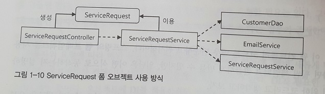
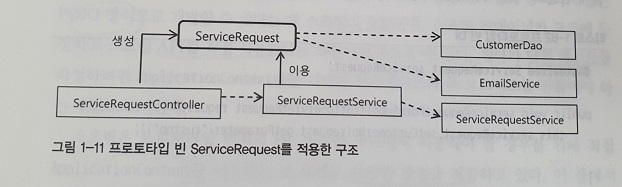
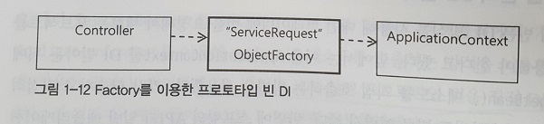
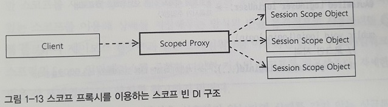

# 1.3 프로토타입과 스코프

1.3.1  싱글톤 이외의 빈

- 대부분의 빈은 싱글톤임
- 싱글톤이 아닌 빈은 크게 **두 가지**로 나눌 수 있음
    1. 프로토타입 빈
    2. 스코프 빈
- 물론 싱글톤과 프로토타입은 스코프의 한 종류임
- 하지만, 싱글톤과 프로토타입은 나머지 스코프들과 성격이 크게 다르기 때문에 구분하는 것이 좋음

<aside>
💡 스코프는 빈이 존재할 수 있는 범위를 뜻함

</aside>

1.3.2 프로토타입 스코프

- 프로포타입 스코프는 컨테이너에게 빈을 요청할 때 마다 매번 새러운 오브젝트를 생성함
    
    ```java
    public class ScopeTest {
        @Test
        public void prototypeScope(){
            ApplicationContext ac = new AnnotationConfigApplicationContext(
                    PrototypeBean.class, PrototypeClientBean.class
            );
             //Set은 중복된 값을 허용하지 않음
            Set<PrototypeBean> bean = new HashSet<>();
            //DL 방식으로 빈을 요청할 때 마다 새로운 빈이 추가되는지 확인
            bean.add(ac.getBean(PrototypeBean.class));
            assertThat(bean.size(), is(1));
            bean.add(ac.getBean(PrototypeBean.class));
            assertThat(bean.size(), is(2));
            //DI 방식으로 빈을 요청할 때 마다 새로운 빈이 추가되는지 확인
            bean.add(ac.getBean(PrototypeClientBean.class).bean1);
            assertThat(bean.size(), is(3));
            bean.add(ac.getBean(PrototypeClientBean.class).bean2);
            assertThat(bean.size(), is(4));
    
        }
    
        @Scope("prototype")
        static class PrototypeBean{}
    
        static class PrototypeClientBean{
            @Autowired PrototypeBean bean1;
            @Autowired PrototypeBean bean2;
        }
    }
    ```
    
- 테스트 결과 처럼 DI이든 DL이든 상관없이 매번 새로운 오브젝트가 만들어지는 것을 확인할 수 있음
- getBean(), @Autowired, <property> 같은 DI 선언도 각각 독립적인 빈 요청에 해당 됨

1.3.3 프로토타입 빈의 생명주기와 종속성

- IoC의 **기본 개념**은 애플리케이션을 구성하는 **핵심 오브젝트**를 코드가 아닌 **컨테이너가 관리**한다는 것임
- 그래서 스프링이 관리하는 오브젝트인 빈은 생성, 초기화, 주입, 생명주기, 소멸 등의 모든 작업을 컨테이너가 관리함
- 그런데, **프로토타입 빈**은 독특하게 이 IoC의 기본원칙을 따르지 않음
- 프로토타입 빈 오브젝트는 한 번 DL이나 DI를통해 컨테이너 밖으로 전달된 후에는 더이상 스프링이 관리하는 빈이 아님
- 빈을 주입받은 다른 빈이 사실살 컨테이너가 제공한 빈 오브젝트를 관리 함
- 프로토타입 빈은 컨테이너가 초기 생성 시에만 관여하고 DI 한 후에는 더이상 관여하지 않기 때문에, 프로토타입 빈은 이 빈을 주입받은 오브젝트에 **종속적**일 수 밖에 없음
- 싱글톤 빈이 프로토타입 빈을 주입 받으면, 주입된 프로토타입 빈은 싱글톤 생명주기를 
따르게 됨

1.3.4 프로토타입의 용도

- 서버 요청에 따라 독립적으로 오브젝트를 생성해서 **상태**를 **저장**해야 하는 경우 도메인 오브젝트나 DTO를 new 키워드로 생성하고 전달하면 됨
    
    <aside>
    💡 대부분의 싱글톤은 상태 없이 읽기 전용으로 만들어야 함
    
    </aside>
    
- 프로토타입 빈은 코드에서 new로 오브젝트를 생성하는 것을 **대신**하기 위해 사용됨
- 대부분 new로 충분한 작업을 번거롭게 컨테이너에게 요청할 필요는 없음
- 드물긴 하지만, 매번 새롭게 만들어지는 오브젝트가 D를 통해 컨테이너 내의 **빈**을 사용해야 하는 경우 **프로토타입**이 사용됨

1.3.5 프로토타입 예시 - 1

- 고객의 A/S 신청을 받아서 접수하는 기능을 만들 것임
- 고객의 정보를 전달할 DTO를 만들어야 함
    
    ```java
    public class ServiceRequest {
        String customerNo; //폼에서 입력받은 고객번호를 저장할 프로퍼티
        String ProductNo;
        String description;
        ...
    }
    ```
    
- 요청마다 다른 정보를 담을 `ServiceRequest`의 오브젝트는 매번 새롭게 만들어지기 때문에, new 연산자로 생성
    
    ```java
    public class ServiceRequestController {
        public void serviceRequestFormSummit(HttpServletRequest request){
            ServiceRequest serviceRequest = new ServiceRequest(); //생성
            serviceRequest.setCustomerNo(request.getParameter("custno"));
            ...
            this.serviceRequestService.addNewService(serviceRequest);
            ...
        }
    }
    
    public class ServiceRequestService {
        public void addNewService(ServiceRequest serviceRequest){
            Customer customer = this.customerDao.
                    findCustomerByNo(serviceRequest.getCustomerNo());
            ...
            this.serviceRequestDao.add(serviceRequest, customer);
            this.emailService.sendEmail(customer.getEmail(), "A/S 접수 성공");
        }
    }
    ```
    
- 매우 단순하고 원시적인 방법임
    
    
    
- 폼 정보의 입력 방법이 모든 계층의 코드와 강하게 연결된 것이 **문제**됨
- 만약 id를 통한 로직으로 변경되면 컨트롤러, 서비스, DTO 등의 로직을 수정해야 함
- 이는 전형적인 **데이터 중심의 아키텍처**가 만들어내는 구조임
- 폼에서 어떻게 입력받는지에 따라 달라지는 값에 의존하고 있으면 안됨
- `ServiceRequest`에서 String 값이 아닌, 오브젝트를 전달하게 해야됨
    
    ```java
    public class ServiceRequest {
        Customer customer; // 오브젝트로 전달
        String ProductNo;
        String description;
        ...
    }
    ```
    
- 오브젝트로 전달을 받으면 서비스 계층의 코드는 더욱 깔끔해 짐
    
    ```java
    public class ServiceRequestService {
        public void addNewService(ServiceRequest serviceRequest){
            this.serviceRequestDao.add(serviceRequest);
            this.emailService.sendEmail(serviceRequest.getCustomer().getEmail(), "A/S 접수 성공");
        }
    }
    ```
    

1.3.6 프로토타입 예시 - 2

- 폼에서는 아직 문자열로 된 고객번호를 입력받기 때문에, 이를 `Customer` 오브젝트로 변환해야 함
- `ServiceRequest`가 직접 `CustomerDao`에 접근하여 변경할 수 있도록 해야 함
    
    ```java
    public class ServiceRequest {
        Customer customer; // 오브젝트로 전달
        ...
        @Autowired CustomerDao customerDao;
    
        public void setCustomerByCustomerNo(String customerNo){
            this.customer = customerDao.findCustomerByNo(cutomerNo);
        }
        //id를 통해 검색
        public void setCustomerByCustomerId(int customerId){
            this.customer = this.customerDao.getCustomer(customerId);
        }
    }
    ```
    
- 남은 문제는 컨트롤러에서 new 키워드로 직접 생성하는 `ServiceRequest`오브젝트에 어떻게 DI를 적용해서 `CustomerDao`를 주입할 것인가에 대한 문제임
- 이는 프로토타입을 통해 해결할 수 있음
    
    ```java
    //자바 설정파일 이용시
    @Component
    @Scope("prototype")
    public class ServiceReques{...}
    ```
    
    ```xml
    //XML 설정팡리 이용시
    <bean id="serviceRequest" class="..ServiceRequest" scope="prototype">
    ```
    
- 프로토타입으로 생성하면 요청시마다 새로운 오브젝트가 생성되기 때문에, new를 하지 않아도 됨
- 프로토타입 빈을 가져오는 방법은 DL 방식으로 함
    
    ```java
    @Autowired Applicationcontext context;
    
    public class ServiceRequestController {
        public void serviceRequestFormSummit(HttpServletRequest request){
            ServiceRequest serviceRequest = this.context.getBean(ServiceRequest.class);
            serviceRequest.setCustomerNo(request.getParameter("custno"));
            ...
        }
    }
    
    ```
    
- `ServiceRequest`도 자유롭게 DI 받을 수 있는 빈이 됐으니 다른 빈을 주입받을 수 있음
    
    ```java
    public class ServiceRequest {
        Customer customer;
        @Autowired EmailService emailService;
        
        public void notifyServiceRequestRegistration(){
            if(this.customer.serviceNotificationMethod == NotificationMethd.EMAIL){
                this.emailService.sendEmail(customer.getEmail(), "A/S 접수 완료");
            }
        }
    }
    ```
    
- 이로 인해 서비스 계층은 더욱 깔끔해 질 수 있음
    
    ```java
    public class ServiceRequestService {
        public void addNewService(ServiceRequest serviceRequest){
            this.serviceRequestDao.add(serviceRequest);
            serviceRequest.notifyServiceRequestRegistration();
        }
    }
    ```
    
- 이로써 의존관계는 기존의 기본적이고 원시적인 의존관계와 달리 낮은 결합도를 보임
    
    
    
- 이렇게 매번 새롭게 오브젝트를 만들면서 DI도 함께 적용하려고 할 때 **프로토타입 빈**이 사용될 수 있음
- 데이터 중심 설계와 개발이 선호된다면 굳이 프로토타입 빈을 만들지 않아도 되지만, 좀 더 오브젝트 중심적이고 유연한 확장을 고려한다면 사용하는 편이 좋음
- 고급 AOP 기능을 사용한다면 프로토타입을 사용하지 않더라도 DI를 할 수 있지만, 부가적인 작업이 필요함

1.3.7 DI와 DL

- 프로토타입 빈을 DL 방식이 아닌 DI 방식으로 적용하면 테스트 상에서는 문제가 없지만, 운영 시스템 상에서는 심각한 문제가 됨
- 대부분의 빈은 싱글톤임
- 즉, 빈은 애플리케이션 컨텍스트가 만들어질 때 **한 번**만 생성이 되고, DI 작업 역시 빈 오브젝트가 처음 만들어질 때 **한 번**만 진행 됨
- `ServiceRequest` 빈을 프로토타입으로 만들었다 하더라도, **컨트롤러**는 싱글톤이기 때문에 한 번만 DI 받음
- 즉 컨트롤러는 단 하나의 `ServiceRequest`를 가지기 때문에, 동시에 여러 사용자가 `ServiceRequest`의 상태를 변경한다면 데이터가 덮어씌어지는 문제가 발생함
- 필요할 때마다 컨테이너에게 요청해서 새로운 오브젝트를 만들어야 하기 때문에 컨테이너 자체를 주입받아 사용하는 DL 방식을 사용해야 함

1.3.8 프로토타입 빈의 DL 전략

- POJO 방식으로 개발할 수 있다는 것이 스프링의 장점인데, 애플리케이션 컨텍스트와 같이 스프링 API가 일반 애플리케이션 코드에 나타나는 것이 불편할 수 있음
- 단위 테스트를 위해 일반 코드에 API가 없는 것이 좋음
- 스프링은 프로토타입 빈처럼 DL 방식을 코드에서 사용해야 할 경우를 위해 직접 `ApplicationContext`를 이용하는 방법을 포함해 다양한 방법을 제공함
    1. ApplicationContext, BeanFactory
        - `ApplicationContext`, `BeanFactory`를 DI 받은 뒤, getBean() 메소드를 호출해서 빈을 가져오는 방법임
        - XML만을 사용한다면 `ApplicationContextAware`, `BeanFactoryAware` 인터페이스를 이용해도 됨
    2. ObjectFactory, ObjectFactoryCreatingFactoryBean
        - 중간에 getBean()을 호출해주는 역할을 맡는 오브젝트를 만들어서 사용
            
            
            
        - **팩토리**를 사용하여 오브젝트를 생성 방법이나 호출 방법에 대해 신경을 쓰지 않도록 함
        - 팩토리를 만들어 빈으로 등록하고, getObject()를 통헤 빈을 호출하도록 함
        - 적어도 `ApplicationContextAware`와 getBean() 처럼 로우레벨의 API를 사용하지 않기 때문에 코드가 깔끔해짐
        - 인터페이스와 팩토리 클래스를 직접 만들기 귀찮다면, 스프링이 제공하는 `ObjectFactory` 인터페이스를 구현한 `ObjectFactoryCreatingFactoryBean`를 사용
            
            ```xml
            <!--xml 설정파일 사용 시-->
            <bean id="serviceRequestFactory" 
                  class="org.springframework.beans.factory.config.ObjectFactoryCreatingFactoryBean">
                <!--팩토리 메소드에서 getBean()으로 가져올 빈의 이름을 value에 넣음-->
                <property name="targetBeanName" value="serviceRequest"/>
            </bean>
            ```
            
            ```java
            //자바 설정파일 사용 시
            @Configuration
            public class ObjectFactoryConfig {
                @Bean
                public ObjectFactoryCreatingFactoryBean serviceRequestFactory(){
                    ObjectFactoryCreatingFactoryBean factoryBean = 
                            new ObjectFactoryCreatingFactoryBean();
                    factoryBean.setTargetBeanName("serviceRequest");
                    return factoryBean;
                }
            }
            ```
            
            ```java
            public class ServiceRequestController {
                
                //ObjectFactory타입은 여러개 있을 수 있으므로 이름을 통해 찾음
                @Resource
                private ObjectFactory<ServiceRequest> serviceRequestObjectFactory;
                
                public void serviceRequestFormSummit(HttpServletRequest request){
                    ServiceRequest serviceRequest = this.serviceRequestObjectFactory.getObject();
                    serviceRequest.setCustomerNo(request.getParameter("custno"));
                    ...
                }
            }
            ```
            
    3. ServiceLocatorFactoryBean
        - ObjectFactory는 단순하고 깔끔하지만, 프레임워크의 인터페이스를 애플리케이션 코드에서 사용하는 것이 마음에 들지 않을 수 있음
        - 또한, 기존의 만들어둔 팩토리 인터페이스를 활용하고 싶을 때 `ServiceLocatorFactoryBean`을 사용하면 됨
        - `ServiceLocatorFactoryBean`는 DL 방식으로 가져올 빈을 리턴하는 임의의 이름을 가진 메소드가 정의된 인터페이스가 있으면 됨
            
            ```java
            public interface ServiceRequestFactory{
                ServiceRequest getServiceFactory();
            }
            ```
            
        - 정의한 인터페이스를 이용해 `ServiceLocatorFactoryBean`을 등록해야 함
            
            ```xml
            <bean class="org.springframework.beans.factory.config.ServiceLocatorFactoryBean">
                <!--value에 팩토리 인터페이스를 지정. 빈의 실제 타입이 됨-->
                <property name="serviceLocatorInterface" value="...ServiceRequestFacotory"/>
            </bean>
            ```
            
        - `ServoceRequest`전용으로 만든 인터페이스가 빈의 타입이 되기 때문에, @Autowired를 이용해 타입으로 가져올 수 있음
            
            ```java
            public class ServiceRequestController {
                @Autowired ServieRequestFactory serviceRequestFactory;
                public void serviceRequestFormSummit(HttpServletRequest request){
                    ServiceRequest serviceRequest = this.serviceRequestFactory.getServiceFactory();
                    serviceRequest.setCustomerNo(request.getParameter("custno"));
                    ...
                }
            }
            ```
            
    4. 메소드 주입
        - 첫 번째 방법은 스프링 API에 의존하는 코드를 만드는 불편함이 있음
        - 두세 번째 방법은 깔끔하지만, 빈을 새로 추가해야하는 번거로움이 있음
        - **메소드 주입** 방법은 위 문제를 해결함
        - 메소드 주입은 메소드 코드 자체를 주입하는 것을 말함
        - 일정한 규칙을 따르는 **추상 메소드**를 작성해두면 DL을 통해 `ApplicationContext`와 getBean() 메소드를 사용해서 **프로토타입 빈**을 담당하는 메소드를 **런타임** 시에 추가하는 기술임
        - 빈을 통해 추상 메소드를 주입함
            
            ```java
            <bean id="serviceRequestController" class="...ServiceRequsetController">
                <lookup-method name="getServiceRequest" bean="serviceRequest"/>
            </bean>
            ```
            
            ```java
            public abstract class ServiceRequestController {
                abstract public Servicerequest getServiceRequest();
                public void serviceRequestFormSummit(HttpServletRequest request){
                    ServiceRequest serviceRequest = this.getServiceRequest();
                    serviceRequest.setCustomerNo(request.getParameter("custno"));
                    ...
                }
            }
            ```
            
        - name이 스프링이 구현해줄 추상메소드의 이름이고, bean 애트리뷰트는 메소드에서 getBean()으로 가져올 빈의 이름임
        - 이렇게 설정해 두면 스프링은 추상 클래스를 상속해서 getServiceRequest() 메소드를 완성하고 상속한 클래스를 빈으로 들록함
        - 클래스 자체가 추상 클래스이므로 테스트에서 사용할 때 오버라이드한 뒤에 사용해야 하는 단점이 있음
        - 단위 테스트를 많이 사용하게 된다면 단점이 많은 방법임
    5. Provider<T>
        - 표준 인터페이스 `Provider`를 이용하는 방법임
        - `Provider`은 `ObjectFactory`와 거의 유사하게 <T> 타입 **파라미터**와 get()이라는 **팩토리 메소드**를 가진 인터페이스임
        - 기본 개념은 `ObjectFactory`와 유사하지만, `ServiceLocatorFactoryBean`을 이용해 빈을 등록하지 않아도 되므로 편리함
        - Provider 인터페이스를 @Inject, @Autowired, @Resource 중 하나를 이용해 DI 되도록 **지정**해주기만하면 스프링이 **자동**으로 Provider를 구현한 오브젝트를 **생성**해서 **주입**함
            
            ```java
            public class ServiceRequestController {
                @Inject
                Provider<ServiceRequest> serviceRequestProvider;
            
                public void serviceRequestFormSummit(HttpServletRequest request){
                    ServiceRequest serviceRequest = this.serviceRequestProvider.get();
                    serviceRequest.setCustomerNo(request.getParameter("custno"));
                    ...
                }
            }
            ```
            
    

1.3.9 스코프의 종류

- 스프링은 싱글톤, 프로토타입 외에 **네 가지** 스코프를 기본적으로 제공함
    1. 요청 스코프
    2. 세선 스코프
    3. 글로벌세션 스코프
    4. 애플리케이션 스코프
    
    <aside>
    💡 네 가지 스코프는 웹 환경에서만 의미가 있음
    
    </aside>
    
- 네 가지 스코프 중에서 애플리케이션 스코프를 제외한 나머지 세 가지 스코프는 싱글톤과 다르게 독립적인 **상태**를 **저장**해두고 사용하는 데 필요험
- 오브젝트 상태를 저장해둘 수 있는 이유는 사용자마다 빈이 만들어지는 덕분임

1.3.10 요청 스코프

- 웹 요청 안에서 만들어지고 해당 용청이 끝날 때 제거됨
- **요청별**로 **독립적인 빈**이 만들어지기 때문에 빈 오브젝트 내에 상태 값을 저장해도 **안전**함
- 요청 스코프는 DL 방법이 편하지만, 원한다면 DI를 이용할 수 있음
- 요청 스코프 존재 범위와 특징은 메소드 파라미터로 전달되는 도메인 오브젝트나 DTO와 비슷함
- 그렇기 때문에 애플리케이션 코드에서 요청 스코프의 빈을 사용할 이유는 많지 않음
- 하나의 요청에서 유지되는 정보는 파라미터나 리턴 값으로 넘기면 됨
- 요청 스코프의 주요 용도는 애플리케이션 코드에서 생성한 정보를 프레임워크 레벨의 서비스나 인터셉터 등에 전달하는 것임
- 또는 애플리케이션 코드가 호출되기 전에 프레임워크나 인터셉터 등에서 생성한 정보를 애플리케이션 코드에 사용할 때 유용함
- 즉, 파라미터로 전달될 필요는 없지만 필요한 곳에서 참조해야 할 때 유용함
- 과용하면 전역 변수를 사용하는 것처럼 이해하기 힘들어지므로 주의해야 함

1.3.11 세션 스코프

- HTTP 세션은 사용자별로 만들어지고 브라우저를 닫거나 세션 타임이 종료될 때까지 유지되기 때문에, 로그인 정보나 사용자별 선택옵션 등을 저장해두기 유용함
- 하지만 HTTP 세션을 집접 이용하는 것은 번거롭고, 컨트롤러 계층에서만 접근할 수 있음
- 웹 환경 종속적인 `HttpSession`을 다른 계층에 넘겨서 사용하는 것은 매우 바람직하지 못함
- DTO와 같은 별도의 오브젝트에 정보를 담아 전달해야 함
- 웹 페이지가 바뀌고 여러 요청을 거치는 동안에도 세션 스코프 빈은 계속 유지됨
- HTTP 세션은 사용자별로 만들어지기 때문에 중복의 위험도 없음

1.3.12 글로벌세션 스코프

- 포틀릿에만 존재하는 글로벌 세션에 저장되는 빈임

1.3.13 애플리케이션 스코프

- 서블릿 컨텍스트에 저장되는 빈 오브젝트임
- 서블릿 컨텍스트는 웹 애플리케이션마다 만들어지고, 웹 애플리케이션마다 스프링의 애플리케이션 컨텍스트가 만들어짐
- 즉, 애플리케이션 스코프는 컨텍스트가 존재하는 동안 유지되는 싱글톤 스코프와 비슷한 존재 범위를 가짐
- 드물지만 웹 애플리케이션과 애플리케이션 컨텍스트의 존재 범위가 다른 경우가 있기 때문에 애플리케이션 스코프가 있는 것임
- 애플리케이션 스코프는 싱글톤과 마찬가지로 상태를 갖지 않고, 읽기 전용으로 만들고, 멀티스레드 환경에서 안전하도록 해야함

1.3.14 스코프 빈의 사용 방법

- 애플리케이션 스코프를 제외한 나머지 세 가지 스코프는 프로토타입 빈과 마찬가지로 한 개 이상의 빈 오브젝트가 생성됨
- 하지만, 프로토타입과 달리 세 가지 스코프 빈은 **생성 시점**이 **명확**하므로 컨테이너가 생성부터 소멸까지 빈의 모든 과정을 관리함
- 그러나 프로토타입과 마찬가지로 하나 이상의 오브젝트가 만들어지기 때문에 싱글톤에 DI 해주는 방법으로 사용할 수 없음
    
    <aside>
    💡 싱글톤에 DI하면 오브젝트 생성이 한 번만 일어나기 때문임
    
    </aside>
    
- 특히 요청 스코프는 요청이 발생하기 전 까지 빈이 만들어지지 않기 때문에, 컨텍스트 초기화 시점에 존재하지 않아 에러가 발생함
- 때문에 스프링이 제공하는 특별한 DI 방법을 사용해야 함
- 직접 스코프 빈을 DI하는 대신 스코프 빈에 **프록시**를 DI해주는 것임

1.3.15 DL 방식의 세션 스코프 빈의 사용

- DL 방식으로 만들고, 프록시를 사용한 DI 방식으로 변경할 것임
- 사용할 세션 스코프를 만들어야 함
    
    ```java
    @Scope("session")
    public class LoginUser {
        String loginId;
        String name;
        Date LoginTime;
    }
    ```
    
- 이를 DL 방식으로 가져옴
    
    ```java
    public class LoginService {
        //DL 방식으로 접근할 수 있도록 Provider를 사용해 DI 받음
        @Autowired Provider<LoginUser> loginUserProvider;
        
        public void login(Login login){
            LoginUser loginUser = loginUserProvider.get();
            loginUser.setLoginId(...);
            ...
        }
    }
    ```
    

1.3.16 DI 방식의 세션 스코프 빈의 사용

- 스코프 빈을 DI 방식으로 사용하려면 프록시의 도움이 필요함
- 클라이언트는 **스코프 프록시(Scope Proxy)** 오브젝트를 실제 스코프 빈 처럼 사용하면 프록시에서 현재 스코프에 맞는 실제 빈 오브젝트 작업을 위임함
    
    
    
- @Scope 애노테이션으로 스코프를 지정했다면, proxyMode 엘리먼트를 이용해서 프록시를 이용한 DI가 되도록 지정할 수 있음
    
    ```java
    @Scope(value = "session", proxyMode = ScopedProxyMode.TARGET_CLASS)
    public class LoginUser {
        String loginId;
        String name;
        Date LoginTime;
    }
    ```
    
    <aside>
    💡 클라이언트에서 인터페이스로 DI 받는다면 ScopeProxyMode.INTERFACES로 지정하고, 프로시 빈 클래스를 직접 DI 한다면 ScopedProxyMode.TARGET_CLASS로 지정
    
    </aside>
    
- 위와 같이 설정하면, 스코프 프록시는 실제 스코프 오브젝트인 `LoginUser`을 상속하고 있어서 클라이언트인 `LoginService`에서는 평범함 `LoginUser` 타입의 오브젝트로 사용할 수 있음
    
    ```java
    public class LoginService {
        //스코프에 따라서 다른 오브젝트로 연결되는 프록시가 주입됨
        @Autowired LoginUser loginUser;
    
        public void login(Login login){
            this.loginUser.setLoginId(...); //세션이 다르면 다른 오브젝트의 메소드 호출
            ...
        }
    }
    ```
    
- XML로 스코프 빈 등록방법
    
    ```xml
    <bean id="loginUser" class="...LoginUser" scope="session">
        <aop:scoped-proxy proxy-target-class="true"/>
    </bean>
    ```
    

1.3.17 커스텀 스코프와 상태를 저장하는 빈 사용하기

- 스프링이 기본적으로 제공하는 스코프 외에도 임의의 스코프를 만들어 사용할 수 있음
- 하지만, 매우 복잡한 작업임
- 유연하게 정의할 수 있는 스코프를 이용해 상태를 저장해두는 방식의 빈을 본격적으로 사용하려면 **스프링 웹 플로우**나 **제이보스 씸**과 같은 프레임워크를 이용하면 됨
- 빈의 상태를 저장하지 않는 방식을 선호한다면 유지해야 할 상태정보는 URL 파라미터, 쿠키, 폼 히든 필드, DB, HTTP 세션에 분산해서 저장하고 이를 코드로 관리해야 함
- 필요가 없느 상태정보는 가능한 빨리 제거해야 함